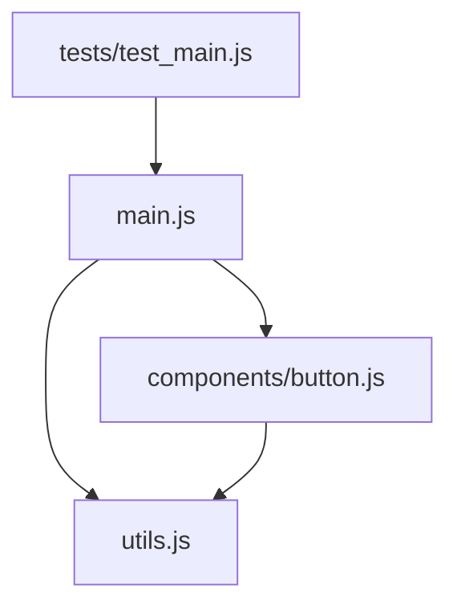
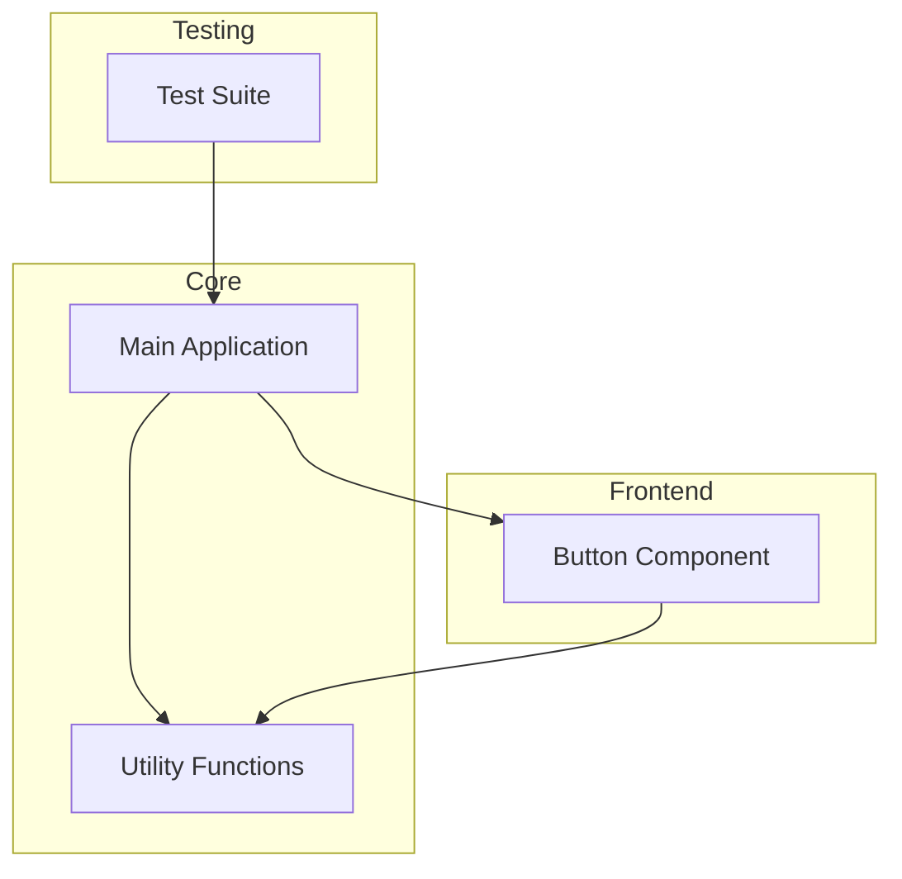

# Simple Project Codebase

## Table of Contents
- [Overview](#overview)
- [File Structure](#file-structure)
- [Dependencies](#dependencies)
- [Architecture and Relationships](#architecture-and-relationships)
- [Source Code](#source-code)
  - [src/main.js](#srcmainjs)
  - [src/utils.js](#srcutilsjs)
  - [src/components/button.js](#srccomponentsbuttonjs)
  - [tests/test_main.js](#teststest_mainjs)

## Overview
This is a flattened representation of the Simple Project codebase, generated by CodeFlattener extension.

## File Structure
```
simple_project/
├── src/
│   ├── main.js
│   ├── utils.js
│   └── components/
│       └── button.js
└── tests/
    └── test_main.js
```

## Dependencies
This section outlines file dependencies detected in the codebase.

## Architecture and Relationships

### File Dependency Diagram


### Component Interaction Diagram


## Source Code

### src/main.js
```javascript
// Main application file
const utils = require('./utils');
const components = require('./components/button');

/**
 * Main application entry point
 */
function main() {
  console.log('Starting application...');
  
  // Initialize components
  const button = components.createButton('Submit');
  
  // Use utility functions
  const data = utils.processData([1, 2, 3, 4, 5]);
  
  console.log(`Button ${button.id} created`);
  console.log(`Processed data: ${data}`);
  
  return { button, data };
}

module.exports = { main };
```

### src/utils.js
```javascript
/**
 * Utility functions for the application
 */

/**
 * Process an array of data
 * @param {Array} data - The input data array
 * @return {Array} - The processed data
 */
function processData(data) {
  return data.map(item => item * 2);
}

/**
 * Format a string with a specific prefix
 * @param {string} str - Input string
 * @return {string} - Formatted string
 */
function formatString(str) {
  return `formatted: ${str}`;
}

module.exports = {
  processData,
  formatString
};
```

### src/components/button.js
```javascript
/**
 * Button component module
 */
const utils = require('../utils');

/**
 * Create a new button with the specified label
 * @param {string} label - Button text label
 * @return {Object} - Button object
 */
function createButton(label) {
  const id = `btn_${Math.floor(Math.random() * 1000)}`;
  const formattedLabel = utils.formatString(label);
  
  return {
    id,
    label: formattedLabel,
    render: () => `<button id="${id}">${formattedLabel}</button>`,
    onClick: (callback) => {
      console.log(`Button ${id} clicked`);
      if (callback) callback();
    }
  };
}

module.exports = {
  createButton
};
```

### tests/test_main.js
```javascript
/**
 * Tests for the main application
 */
const { main } = require('../src/main');

// Test the main function
console.log('Testing main application...');
const result = main();

console.log('Testing button rendering...');
console.log(result.button.render());

console.log('Testing button click event...');
result.button.onClick(() => {
  console.log('Button callback executed');
});

console.log('All tests passed!');
```
