# Project Digest Continued: test_project
Generated on: Sun Mar 23 2025 09:04:22 GMT+0100 (Central European Standard Time)

[Error: Could not read file]
[Error: Could not read file]
[Error: Could not read file]
[Error: Could not read file]
[Error: Could not read file]
[Error: Could not read file]
[Error: Could not read file]
[Error: Could not read file]
[Error: Could not read file]
[Error: Could not read file]
[Error: Could not read file]
[Error: Could not read file]
[Error: Could not read file]
[Error: Could not read file]
[Error: Could not read file]
[Error: Could not read file]
[Error: Could not read file]
[Error: Could not read file]
[Error: Could not read file]
[Error: Could not read file]
[Error: Could not read file]
[Error: Could not read file]
[Error: Could not read file]
[Error: Could not read file]
[Error: Could not read file]
[Error: Could not read file]
[Error: Could not read file]
[Error: Could not read file]
[Error: Could not read file]
[Error: Could not read file]
[Error: Could not read file]
[Error: Could not read file]
[Error: Could not read file]
[Error: Could not read file]
[Error: Could not read file]
[Error: Could not read file]
[Error: Could not read file]
[Error: Could not read file]
[Error: Could not read file]
[Error: Could not read file]
[Error: Could not read file]
[Error: Could not read file]
[Error: Could not read file]
[Error: Could not read file]
[Error: Could not read file]
[Error: Could not read file]
[Error: Could not read file]
[Error: Could not read file]
[Error: Could not read file]
[Error: Could not read file]
[Error: Could not read file]
[Error: Could not read file]
[Error: Could not read file]
[Error: Could not read file]
[Error: Could not read file]
[Error: Could not read file]
[Error: Could not read file]
[Error: Could not read file]
[Error: Could not read file]
[Error: Could not read file]
[Error: Could not read file]
[Error: Could not read file]
[Error: Could not read file]
[Error: Could not read file]
[Error: Could not read file]
[Error: Could not read file]
[Error: Could not read file]
[Error: Could not read file]
[Error: Could not read file]
[Error: Could not read file]
[Error: Could not read file]
[Error: Could not read file]
[Error: Could not read file]
[Error: Could not read file]
[Error: Could not read file]
[Error: Could not read file]
[Error: Could not read file]
[Error: Could not read file]
[Error: Could not read file]
[Error: Could not read file]
[Error: Could not read file]
[Error: Could not read file]
[Error: Could not read file]
[Error: Could not read file]
[Error: Could not read file]
[Error: Could not read file]
[Error: Could not read file]
[Error: Could not read file]
[Error: Could not read file]
[Error: Could not read file]
[Error: Could not read file]
[Error: Could not read file]
[Error: Could not read file]
[Error: Could not read file]
[Error: Could not read file]
[Error: Could not read file]
[Error: Could not read file]
[Error: Could not read file]
[Error: Could not read file]
[Error: Could not read file]
[Error: Could not read file]
[Error: Could not read file]
[Error: Could not read file]
[Error: Could not read file]
[Error: Could not read file]
[Error: Could not read file]
[Error: Could not read file]
[Error: Could not read file]
[Error: Could not read file]
[Error: Could not read file]
[Error: Could not read file]
[Error: Could not read file]
[Error: Could not read file]
[Error: Could not read file]
[Error: Could not read file]
[Error: Could not read file]
[Error: Could not read file]
[Error: Could not read file]
[Error: Could not read file]
[Error: Could not read file]
[Error: Could not read file]
[Error: Could not read file]
[Error: Could not read file]
[Error: Could not read file]
[Error: Could not read file]
[Error: Could not read file]
[Error: Could not read file]
[Error: Could not read file]
[Error: Could not read file]
[Error: Could not read file]
[Error: Could not read file]
[Error: Could not read file]
[Error: Could not read file]
[Error: Could not read file]
[Error: Could not read file]
[Error: Could not read file]
[Error: Could not read file]
[Error: Could not read file]
[Error: Could not read file]
[Error: Could not read file]
[Error: Could not read file]
[Error: Could not read file]
[Error: Could not read file]
[Error: Could not read file]
[Error: Could not read file]
[Error: Could not read file]
[Error: Could not read file]
[Error: Could not read file]
[Error: Could not read file]
[Error: Could not read file]
[Error: Could not read file]
[Error: Could not read file]
[Error: Could not read file]
[Error: Could not read file]
[Error: Could not read file]
[Error: Could not read file]
[Error: Could not read file]
[Error: Could not read file]
[Error: Could not read file]
[Error: Could not read file]
[Error: Could not read file]
[Error: Could not read file]
[Error: Could not read file]
[Error: Could not read file]
[Error: Could not read file]
[Error: Could not read file]
[Error: Could not read file]
[Error: Could not read file]
[Error: Could not read file]
[Error: Could not read file]
[Error: Could not read file]
[Error: Could not read file]
[Error: Could not read file]
[Error: Could not read file]
[Error: Could not read file]
[Error: Could not read file]
[Error: Could not read file]
[Error: Could not read file]
[Error: Could not read file]
[Error: Could not read file]
[Error: Could not read file]
[Error: Could not read file]
[Error: Could not read file]
[Error: Could not read file]
[Error: Could not read file]
[Error: Could not read file]
[Error: Could not read file]
[Error: Could not read file]
[Error: Could not read file]
[Error: Could not read file]
[Error: Could not read file]
[Error: Could not read file]
[Error: Could not read file]
[Error: Could not read file]
[Error: Could not read file]
[Error: Could not read file]
[Error: Could not read file]
[Error: Could not read file]
[Error: Could not read file]
[Error: Could not read file]
[Error: Could not read file]
[Error: Could not read file]
[Error: Could not read file]
[Error: Could not read file]
[Error: Could not read file]
[Error: Could not read file]
[Error: Could not read file]
[Error: Could not read file]
[Error: Could not read file]
[Error: Could not read file]
[Error: Could not read file]
[Error: Could not read file]
[Error: Could not read file]
[Error: Could not read file]
[Error: Could not read file]
[Error: Could not read file]
[Error: Could not read file]
[Error: Could not read file]
[Error: Could not read file]
[Error: Could not read file]
[Error: Could not read file]
[Error: Could not read file]
[Error: Could not read file]
[Error: Could not read file]
[Error: Could not read file]
[Error: Could not read file]
[Error: Could not read file]
[Error: Could not read file]
[Error: Could not read file]
[Error: Could not read file]
[Error: Could not read file]
[Error: Could not read file]
[Error: Could not read file]
[Error: Could not read file]
[Error: Could not read file]
[Error: Could not read file]
[Error: Could not read file]
[Error: Could not read file]
[Error: Could not read file]
[Error: Could not read file]
[Error: Could not read file]
[Error: Could not read file]
[Error: Could not read file]
[Error: Could not read file]
[Error: Could not read file]
[Error: Could not read file]
[Error: Could not read file]
[Error: Could not read file]
[Error: Could not read file]
[Error: Could not read file]
[Error: Could not read file]
[Error: Could not read file]
[Error: Could not read file]
[Error: Could not read file]
[Error: Could not read file]
[Error: Could not read file]
[Error: Could not read file]
[Error: Could not read file]
[Error: Could not read file]
[Error: Could not read file]
[Error: Could not read file]
[Error: Could not read file]
[Error: Could not read file]
[Error: Could not read file]
[Error: Could not read file]
[Error: Could not read file]
[Error: Could not read file]
[Error: Could not read file]
[Error: Could not read file]
[Error: Could not read file]
[Error: Could not read file]
[Error: Could not read file]
[Error: Could not read file]
[Error: Could not read file]
[Error: Could not read file]
[Error: Could not read file]
[Error: Could not read file]
[Error: Could not read file]
[Error: Could not read file]
[Error: Could not read file]
[Error: Could not read file]
[Error: Could not read file]
[Error: Could not read file]
[Error: Could not read file]
[Error: Could not read file]
[Error: Could not read file]
[Error: Could not read file]
[Error: Could not read file]
[Error: Could not read file]
[Error: Could not read file]
[Error: Could not read file]
[Error: Could not read file]
[Error: Could not read file]
[Error: Could not read file]
[Error: Could not read file]
[Error: Could not read file]
[Error: Could not read file]
[Error: Could not read file]
[Error: Could not read file]
[Error: Could not read file]
[Error: Could not read file]
[Error: Could not read file]
[Error: Could not read file]

## Architecture and Relationships

These diagrams visualize code relationships at different levels of abstraction.

### File Dependencies

This diagram shows dependencies between individual source files.

Below is a visualization of file dependencies in the codebase:

```mermaid
graph TD
  F1_src_file with spaces.js["file with spaces.js"]
  F2_src_main.js["main.js"]
  F3_src_large-file.js["large-file.js"]
  F4_src_helper.js["helper.js"]
  F5_src_types.js["types.js"]
  F6_src_utils.js["utils.js"]
  F7_test_project_config.json["config.json"]
  F8_src_types.ts["types.ts"]
  F9_test_project_.gitignore[".gitignore"]
  F10_complex_globs_test_project_flattened_part10.md["test_project_flattened_part10.md"]
  F11_comprehensive_viz_test_project_flattened_part10.md["test_project_flattened_part10.md"]
  F12_special_chars_test_project_flattened_part10.md["test_project_flattened_part10.md"]
  F13_nested_dirs_test_project_flattened_part10.md["test_project_flattened_part10.md"]
  F14_enhanced_toc_test_project_flattened_part10.md["test_project_flattened_part10.md"]
  F15_env_exclusion_test_project_flattened_part10.md["test_project_flattened_part10.md"]
  F16_enhanced_toc_test_project_flattened_part100.md["test_project_flattened_part100.md"]
  F17_complex_globs_test_project_flattened_part100.md["test_project_flattened_part100.md"]
  F18_special_chars_test_project_flattened_part100.md["test_project_flattened_part100.md"]
  F19_gitignore_support_test_project_flattened_part100.md["test_project_flattened_part100.md"]
  F20_nested_dirs_test_project_flattened_part100.md["test_project_flattened_part100.md"]
  F21_empty_excludes_test_project_flattened_part101.md["test_project_flattened_part101.md"]
  F22_enhanced_toc_test_project_flattened_part101.md["test_project_flattened_part101.md"]
  F23_nested_dirs_test_project_flattened_part101.md["test_project_flattened_part101.md"]
  F24_runtime_exclusions_test_project_flattened_part100.md["test_project_flattened_part100.md"]
  F25_env_exclusion_test_project_flattened_part101.md["test_project_flattened_part101.md"]
  F26_special_chars_test_project_flattened_part101.md["test_project_flattened_part101.md"]
  F27_comprehensive_viz_test_project_flattened_part102.md["test_project_flattened_part102.md"]
  F28_empty_excludes_test_project_flattened_part102.md["test_project_flattened_part102.md"]
  F29_env_exclusion_test_project_flattened_part102.md["test_project_flattened_part102.md"]
  F30_gitignore_support_test_project_flattened_part102.md["test_project_flattened_part102.md"]
  F31_special_chars_test_project_flattened_part102.md["test_project_flattened_part102.md"]
  F32_comprehensive_viz_test_project_flattened_part103.md["test_project_flattened_part103.md"]
  F33_empty_excludes_test_project_flattened_part103.md["test_project_flattened_part103.md"]
  F34_env_exclusion_test_project_flattened_part103.md["test_project_flattened_part103.md"]
  F35_runtime_exclusions_test_project_flattened_part102.md["test_project_flattened_part102.md"]
  F36_complex_globs_test_project_flattened_part103.md["test_project_flattened_part103.md"]
  F37_enhanced_toc_test_project_flattened_part103.md["test_project_flattened_part103.md"]
  F38_gitignore_support_test_project_flattened_part103.md["test_project_flattened_part103.md"]
  F39_special_chars_test_project_flattened_part103.md["test_project_flattened_part103.md"]
  F40_complex_globs_test_project_flattened_part104.md["test_project_flattened_part104.md"]
  F41_runtime_exclusions_test_project_flattened_part103.md["test_project_flattened_part103.md"]
  F42_comprehensive_viz_test_project_flattened_part104.md["test_project_flattened_part104.md"]
  F43_runtime_exclusions_test_project_flattened_part104.md["test_project_flattened_part104.md"]
  F44_complex_globs_test_project_flattened_part105.md["test_project_flattened_part105.md"]
  F45_nested_dirs_test_project_flattened_part104.md["test_project_flattened_part104.md"]
  F46_comprehensive_viz_test_project_flattened_part105.md["test_project_flattened_part105.md"]
  F47_env_exclusion_test_project_flattened_part105.md["test_project_flattened_part105.md"]
  F48_complex_globs_test_project_flattened_part106.md["test_project_flattened_part106.md"]
  F49_comprehensive_viz_test_project_flattened_part106.md["test_project_flattened_part106.md"]
  F50_runtime_exclusions_test_project_flattened_part105.md["test_project_flattened_part105.md"]
  F51_nested_dirs_test_project_flattened_part105.md["test_project_flattened_part105.md"]
  F52_empty_excludes_test_project_flattened_part106.md["test_project_flattened_part106.md"]
  F53_runtime_exclusions_test_project_flattened_part106.md["test_project_flattened_part106.md"]
  F54_env_exclusion_test_project_flattened_part106.md["test_project_flattened_part106.md"]
  F55_nested_dirs_test_project_flattened_part106.md["test_project_flattened_part106.md"]
  F56_special_chars_test_project_flattened_part106.md["test_project_flattened_part106.md"]
  F57_enhanced_toc_test_project_flattened_part106.md["test_project_flattened_part106.md"]
  F58_gitignore_support_test_project_flattened_part107.md["test_project_flattened_part107.md"]
  F59_nested_dirs_test_project_flattened_part107.md["test_project_flattened_part107.md"]
  F60_empty_excludes_test_project_flattened_part107.md["test_project_flattened_part107.md"]
  F61_complex_globs_test_project_flattened_part108.md["test_project_flattened_part108.md"]
  F62_complex_globs_test_project_flattened_part107.md["test_project_flattened_part107.md"]
  F63_enhanced_toc_test_project_flattened_part107.md["test_project_flattened_part107.md"]
  F64_special_chars_test_project_flattened_part107.md["test_project_flattened_part107.md"]
  F65_gitignore_support_test_project_flattened_part108.md["test_project_flattened_part108.md"]
  F66_enhanced_toc_test_project_flattened_part108.md["test_project_flattened_part108.md"]
  F67_comprehensive_viz_test_project_flattened_part108.md["test_project_flattened_part108.md"]
  F68_enhanced_toc_test_project_flattened_part109.md["test_project_flattened_part109.md"]
  F69_comprehensive_viz_test_project_flattened_part11.md["test_project_flattened_part11.md"]
  F70_special_chars_test_project_flattened_part108.md["test_project_flattened_part108.md"]
  F71_nested_dirs_test_project_flattened_part109.md["test_project_flattened_part109.md"]
  F72_gitignore_support_test_project_flattened_part109.md["test_project_flattened_part109.md"]
  F73_complex_globs_test_project_flattened_part11.md["test_project_flattened_part11.md"]
  F74_gitignore_support_test_project_flattened_part11.md["test_project_flattened_part11.md"]
  F75_enhanced_toc_test_project_flattened_part11.md["test_project_flattened_part11.md"]
  F76_nested_dirs_test_project_flattened_part11.md["test_project_flattened_part11.md"]
  F77_empty_excludes_test_project_flattened_part11.md["test_project_flattened_part11.md"]
  F78_enhanced_toc_test_project_flattened_part110.md["test_project_flattened_part110.md"]
  F79_special_chars_test_project_flattened_part11.md["test_project_flattened_part11.md"]
  F80_gitignore_support_test_project_flattened_part110.md["test_project_flattened_part110.md"]
  F81_empty_excludes_test_project_flattened_part110.md["test_project_flattened_part110.md"]
  F82_runtime_exclusions_test_project_flattened_part11.md["test_project_flattened_part11.md"]
  F83_env_exclusion_test_project_flattened_part110.md["test_project_flattened_part110.md"]
  F84_comprehensive_viz_test_project_flattened_part111.md["test_project_flattened_part111.md"]
  F85_complex_globs_test_project_flattened_part111.md["test_project_flattened_part111.md"]
  F86_empty_excludes_test_project_flattened_part111.md["test_project_flattened_part111.md"]
  F87_runtime_exclusions_test_project_flattened_part110.md["test_project_flattened_part110.md"]
  F88_complex_globs_test_project_flattened_part112.md["test_project_flattened_part112.md"]
  F89_comprehensive_viz_test_project_flattened_part112.md["test_project_flattened_part112.md"]
  F90_gitignore_support_test_project_flattened_part112.md["test_project_flattened_part112.md"]
  F91_runtime_exclusions_test_project_flattened_part111.md["test_project_flattened_part111.md"]
  F92_empty_excludes_test_project_flattened_part112.md["test_project_flattened_part112.md"]
  F93_runtime_exclusions_test_project_flattened_part112.md["test_project_flattened_part112.md"]
  F94_special_chars_test_project_flattened_part111.md["test_project_flattened_part111.md"]
  F95_special_chars_test_project_flattened_part112.md["test_project_flattened_part112.md"]
  F96_complex_globs_test_project_flattened_part113.md["test_project_flattened_part113.md"]
  F97_nested_dirs_test_project_flattened_part112.md["test_project_flattened_part112.md"]
  F98_comprehensive_viz_test_project_flattened_part113.md["test_project_flattened_part113.md"]
  F99_gitignore_support_test_project_flattened_part113.md["test_project_flattened_part113.md"]
  F100_nested_dirs_test_project_flattened_part113.md["test_project_flattened_part113.md"]
  F101_gitignore_support_test_project_flattened_part114.md["test_project_flattened_part114.md"]
  F102_env_exclusion_test_project_flattened_part113.md["test_project_flattened_part113.md"]
  F103_special_chars_test_project_flattened_part114.md["test_project_flattened_part114.md"]
  F104_enhanced_toc_test_project_flattened_part114.md["test_project_flattened_part114.md"]
  F105_runtime_exclusions_test_project_flattened_part114.md["test_project_flattened_part114.md"]
  F106_nested_dirs_test_project_flattened_part114.md["test_project_flattened_part114.md"]
  F107_env_exclusion_test_project_flattened_part114.md["test_project_flattened_part114.md"]
  F108_special_chars_test_project_flattened_part115.md["test_project_flattened_part115.md"]
  F109_complex_globs_test_project_flattened_part115.md["test_project_flattened_part115.md"]
  F110_gitignore_support_test_project_flattened_part115.md["test_project_flattened_part115.md"]
  F111_nested_dirs_test_project_flattened_part115.md["test_project_flattened_part115.md"]
  F112_enhanced_toc_test_project_flattened_part115.md["test_project_flattened_part115.md"]
  F113_complex_globs_test_project_flattened_part116.md["test_project_flattened_part116.md"]
  F114_enhanced_toc_test_project_flattened_part116.md["test_project_flattened_part116.md"]
  F115_env_exclusion_test_project_flattened_part115.md["test_project_flattened_part115.md"]
  F116_empty_excludes_test_project_flattened_part116.md["test_project_flattened_part116.md"]
  F117_empty_excludes_test_project_flattened_part115.md["test_project_flattened_part115.md"]
  F118_nested_dirs_test_project_flattened_part116.md["test_project_flattened_part116.md"]
  F119_gitignore_support_test_project_flattened_part116.md["test_project_flattened_part116.md"]
  F120_comprehensive_viz_test_project_flattened_part117.md["test_project_flattened_part117.md"]
  F121_nested_dirs_test_project_flattened_part117.md["test_project_flattened_part117.md"]
  F122_runtime_exclusions_test_project_flattened_part116.md["test_project_flattened_part116.md"]
  F123_enhanced_toc_test_project_flattened_part117.md["test_project_flattened_part117.md"]
  F124_env_exclusion_test_project_flattened_part117.md["test_project_flattened_part117.md"]
  F125_comprehensive_viz_test_project_flattened_part118.md["test_project_flattened_part118.md"]
  F126_complex_globs_test_project_flattened_part118.md["test_project_flattened_part118.md"]
  F127_runtime_exclusions_test_project_flattened_part117.md["test_project_flattened_part117.md"]
  F128_env_exclusion_test_project_flattened_part118.md["test_project_flattened_part118.md"]
  F129_runtime_exclusions_test_project_flattened_part118.md["test_project_flattened_part118.md"]
  F130_complex_globs_test_project_flattened_part119.md["test_project_flattened_part119.md"]
  F131_gitignore_support_test_project_flattened_part119.md["test_project_flattened_part119.md"]
  F132_comprehensive_viz_test_project_flattened_part119.md["test_project_flattened_part119.md"]
  F133_special_chars_test_project_flattened_part118.md["test_project_flattened_part118.md"]
  F134_empty_excludes_test_project_flattened_part119.md["test_project_flattened_part119.md"]
  F135_special_chars_test_project_flattened_part119.md["test_project_flattened_part119.md"]
  F136_nested_dirs_test_project_flattened_part118.md["test_project_flattened_part118.md"]
  F137_nested_dirs_test_project_flattened_part119.md["test_project_flattened_part119.md"]
  F138_complex_globs_test_project_flattened_part12.md["test_project_flattened_part12.md"]
  F139_gitignore_support_test_project_flattened_part12.md["test_project_flattened_part12.md"]
  F140_complex_globs_test_project_flattened_part120.md["test_project_flattened_part120.md"]
  F141_empty_excludes_test_project_flattened_part12.md["test_project_flattened_part12.md"]
  F142_runtime_exclusions_test_project_flattened_part12.md["test_project_flattened_part12.md"]
  F143_special_chars_test_project_flattened_part12.md["test_project_flattened_part12.md"]
  F144_env_exclusion_test_project_flattened_part12.md["test_project_flattened_part12.md"]
  F145_enhanced_toc_test_project_flattened_part120.md["test_project_flattened_part120.md"]
  F146_comprehensive_viz_test_project_flattened_part120.md["test_project_flattened_part120.md"]
  F147_empty_excludes_test_project_flattened_part120.md["test_project_flattened_part120.md"]
  F148_env_exclusion_test_project_flattened_part120.md["test_project_flattened_part120.md"]
  F149_complex_globs_test_project_flattened_part121.md["test_project_flattened_part121.md"]
  F150_empty_excludes_test_project_flattened_part121.md["test_project_flattened_part121.md"]
  F151_env_exclusion_test_project_flattened_part121.md["test_project_flattened_part121.md"]
  F152_comprehensive_viz_test_project_flattened_part121.md["test_project_flattened_part121.md"]
  F153_runtime_exclusions_test_project_flattened_part121.md["test_project_flattened_part121.md"]
  F154_special_chars_test_project_flattened_part120.md["test_project_flattened_part120.md"]
  F155_runtime_exclusions_test_project_flattened_part120.md["test_project_flattened_part120.md"]
  F156_special_chars_test_project_flattened_part121.md["test_project_flattened_part121.md"]
  F157_complex_globs_test_project_flattened_part122.md["test_project_flattened_part122.md"]
  F158_special_chars_test_project_flattened_part122.md["test_project_flattened_part122.md"]
  F159_nested_dirs_test_project_flattened_part122.md["test_project_flattened_part122.md"]
  F160_env_exclusion_test_project_flattened_part123.md["test_project_flattened_part123.md"]
  F161_runtime_exclusions_test_project_flattened_part122.md["test_project_flattened_part122.md"]
  F162_gitignore_support_test_project_flattened_part122.md["test_project_flattened_part122.md"]
  F163_gitignore_support_test_project_flattened_part123.md["test_project_flattened_part123.md"]
  F164_nested_dirs_test_project_flattened_part123.md["test_project_flattened_part123.md"]
  F165_comprehensive_viz_test_project_flattened_part124.md["test_project_flattened_part124.md"]
  F166_comprehensive_viz_test_project_flattened_part123.md["test_project_flattened_part123.md"]
  F167_special_chars_test_project_flattened_part123.md["test_project_flattened_part123.md"]
  F168_special_chars_test_project_flattened_part124.md["test_project_flattened_part124.md"]
  F169_env_exclusion_test_project_flattened_part125.md["test_project_flattened_part125.md"]
  F170_gitignore_support_test_project_flattened_part124.md["test_project_flattened_part124.md"]
  F171_empty_excludes_test_project_flattened_part125.md["test_project_flattened_part125.md"]
  F172_complex_globs_test_project_flattened_part126.md["test_project_flattened_part126.md"]
  F173_runtime_exclusions_test_project_flattened_part125.md["test_project_flattened_part125.md"]
  F174_gitignore_support_test_project_flattened_part125.md["test_project_flattened_part125.md"]
  F175_empty_excludes_test_project_flattened_part126.md["test_project_flattened_part126.md"]
  F176_nested_dirs_test_project_flattened_part124.md["test_project_flattened_part124.md"]
  F177_enhanced_toc_test_project_flattened_part126.md["test_project_flattened_part126.md"]
  F178_env_exclusion_test_project_flattened_part126.md["test_project_flattened_part126.md"]
  F179_gitignore_support_test_project_flattened_part126.md["test_project_flattened_part126.md"]
  F180_enhanced_toc_test_project_flattened_part127.md["test_project_flattened_part127.md"]
  F181_complex_globs_test_project_flattened_part127.md["test_project_flattened_part127.md"]
  F182_nested_dirs_test_project_flattened_part127.md["test_project_flattened_part127.md"]
  F183_empty_excludes_test_project_flattened_part128.md["test_project_flattened_part128.md"]
  F184_empty_excludes_test_project_flattened_part127.md["test_project_flattened_part127.md"]
  F185_runtime_exclusions_test_project_flattened_part127.md["test_project_flattened_part127.md"]
  F186_complex_globs_test_project_flattened_part128.md["test_project_flattened_part128.md"]
  F187_runtime_exclusions_test_project_flattened_part126.md["test_project_flattened_part126.md"]
  F188_special_chars_test_project_flattened_part128.md["test_project_flattened_part128.md"]
  F189_nested_dirs_test_project_flattened_part128.md["test_project_flattened_part128.md"]
  F190_enhanced_toc_test_project_flattened_part129.md["test_project_flattened_part129.md"]
  F191_gitignore_support_test_project_flattened_part128.md["test_project_flattened_part128.md"]
  F192_enhanced_toc_test_project_flattened_part128.md["test_project_flattened_part128.md"]
  F193_empty_excludes_test_project_flattened_part129.md["test_project_flattened_part129.md"]
  F194_gitignore_support_test_project_flattened_part129.md["test_project_flattened_part129.md"]
  F195_nested_dirs_test_project_flattened_part129.md["test_project_flattened_part129.md"]
  F196_special_chars_test_project_flattened_part129.md["test_project_flattened_part129.md"]
  F197_env_exclusion_test_project_flattened_part129.md["test_project_flattened_part129.md"]
  F198_enhanced_toc_test_project_flattened_part13.md["test_project_flattened_part13.md"]
  F199_empty_excludes_test_project_flattened_part13.md["test_project_flattened_part13.md"]
  F200_env_exclusion_test_project_flattened_part13.md["test_project_flattened_part13.md"]
  F201_comprehensive_viz_test_project_flattened_part13.md["test_project_flattened_part13.md"]
  F202_complex_globs_test_project_flattened_part13.md["test_project_flattened_part13.md"]
  F203_gitignore_support_test_project_flattened_part13.md["test_project_flattened_part13.md"]
  F204_nested_dirs_test_project_flattened_part13.md["test_project_flattened_part13.md"]
  F205_special_chars_test_project_flattened_part13.md["test_project_flattened_part13.md"]
  F206_runtime_exclusions_test_project_flattened_part13.md["test_project_flattened_part13.md"]
  F207_comprehensive_viz_test_project_flattened_part130.md["test_project_flattened_part130.md"]
  F208_special_chars_test_project_flattened_part130.md["test_project_flattened_part130.md"]
  F209_env_exclusion_test_project_flattened_part130.md["test_project_flattened_part130.md"]
  F210_nested_dirs_test_project_flattened_part130.md["test_project_flattened_part130.md"]
  F211_enhanced_toc_test_project_flattened_part130.md["test_project_flattened_part130.md"]
  F212_env_exclusion_test_project_flattened_part131.md["test_project_flattened_part131.md"]
  F213_gitignore_support_test_project_flattened_part131.md["test_project_flattened_part131.md"]
  F214_comprehensive_viz_test_project_flattened_part131.md["test_project_flattened_part131.md"]
  F215_runtime_exclusions_test_project_flattened_part131.md["test_project_flattened_part131.md"]
  F216_complex_globs_test_project_flattened_part131.md["test_project_flattened_part131.md"]
  F217_nested_dirs_test_project_flattened_part131.md["test_project_flattened_part131.md"]
  F218_env_exclusion_test_project_flattened_part132.md["test_project_flattened_part132.md"]
  F219_complex_globs_test_project_flattened_part132.md["test_project_flattened_part132.md"]
  F220_gitignore_support_test_project_flattened_part132.md["test_project_flattened_part132.md"]
  F221_special_chars_test_project_flattened_part132.md["test_project_flattened_part132.md"]
  F222_nested_dirs_test_project_flattened_part132.md["test_project_flattened_part132.md"]
  F223_comprehensive_viz_test_project_flattened_part132.md["test_project_flattened_part132.md"]
  F224_runtime_exclusions_test_project_flattened_part132.md["test_project_flattened_part132.md"]
  F225_complex_globs_test_project_flattened_part133.md["test_project_flattened_part133.md"]
  F226_special_chars_test_project_flattened_part131.md["test_project_flattened_part131.md"]
  F227_comprehensive_viz_test_project_flattened_part133.md["test_project_flattened_part133.md"]
  F228_gitignore_support_test_project_flattened_part133.md["test_project_flattened_part133.md"]
  F229_empty_excludes_test_project_flattened_part133.md["test_project_flattened_part133.md"]
  F230_complex_globs_test_project_flattened_part134.md["test_project_flattened_part134.md"]
  F231_runtime_exclusions_test_project_flattened_part133.md["test_project_flattened_part133.md"]
  F232_empty_excludes_test_project_flattened_part134.md["test_project_flattened_part134.md"]
  F233_gitignore_support_test_project_flattened_part135.md["test_project_flattened_part135.md"]
  F234_enhanced_toc_test_project_flattened_part134.md["test_project_flattened_part134.md"]
  F235_enhanced_toc_test_project_flattened_part135.md["test_project_flattened_part135.md"]
  F236_complex_globs_test_project_flattened_part135.md["test_project_flattened_part135.md"]
  F237_nested_dirs_test_project_flattened_part135.md["test_project_flattened_part135.md"]
  F238_comprehensive_viz_test_project_flattened_part136.md["test_project_flattened_part136.md"]
  F239_complex_globs_test_project_flattened_part136.md["test_project_flattened_part136.md"]
  F240_runtime_exclusions_test_project_flattened_part135.md["test_project_flattened_part135.md"]
  F241_env_exclusion_test_project_flattened_part136.md["test_project_flattened_part136.md"]
  F242_enhanced_toc_test_project_flattened_part136.md["test_project_flattened_part136.md"]
  F243_runtime_exclusions_test_project_flattened_part136.md["test_project_flattened_part136.md"]
  F244_nested_dirs_test_project_flattened_part136.md["test_project_flattened_part136.md"]
  F245_special_chars_test_project_flattened_part136.md["test_project_flattened_part136.md"]
  F246_complex_globs_test_project_flattened_part137.md["test_project_flattened_part137.md"]
  F247_comprehensive_viz_test_project_flattened_part137.md["test_project_flattened_part137.md"]
  F248_env_exclusion_test_project_flattened_part137.md["test_project_flattened_part137.md"]
  F249_special_chars_test_project_flattened_part137.md["test_project_flattened_part137.md"]
  F250_empty_excludes_test_project_flattened_part138.md["test_project_flattened_part138.md"]
  F251_gitignore_support_test_project_flattened_part137.md["test_project_flattened_part137.md"]
  F252_complex_globs_test_project_flattened_part139.md["test_project_flattened_part139.md"]
  F253_runtime_exclusions_test_project_flattened_part137.md["test_project_flattened_part137.md"]
  F254_special_chars_test_project_flattened_part138.md["test_project_flattened_part138.md"]
  F255_gitignore_support_test_project_flattened_part138.md["test_project_flattened_part138.md"]
  F256_nested_dirs_test_project_flattened_part138.md["test_project_flattened_part138.md"]
  F257_nested_dirs_test_project_flattened_part137.md["test_project_flattened_part137.md"]
  F258_comprehensive_viz_test_project_flattened_part14.md["test_project_flattened_part14.md"]
  F259_special_chars_test_project_flattened_part139.md["test_project_flattened_part139.md"]
  F260_nested_dirs_test_project_flattened_part139.md["test_project_flattened_part139.md"]
  F261_enhanced_toc_test_project_flattened_part14.md["test_project_flattened_part14.md"]
  F262_empty_excludes_test_project_flattened_part14.md["test_project_flattened_part14.md"]
  F263_enhanced_toc_test_project_flattened_part139.md["test_project_flattened_part139.md"]
  F264_nested_dirs_test_project_flattened_part14.md["test_project_flattened_part14.md"]
  F265_runtime_exclusions_test_project_flattened_part14.md["test_project_flattened_part14.md"]
  F266_special_chars_test_project_flattened_part14.md["test_project_flattened_part14.md"]
  F267_complex_globs_test_project_flattened_part140.md["test_project_flattened_part140.md"]
  F268_comprehensive_viz_test_project_flattened_part140.md["test_project_flattened_part140.md"]
  F269_comprehensive_viz_test_project_flattened_part141.md["test_project_flattened_part141.md"]
  F270_special_chars_test_project_flattened_part140.md["test_project_flattened_part140.md"]
  F271_gitignore_support_test_project_flattened_part141.md["test_project_flattened_part141.md"]
  F272_complex_globs_test_project_flattened_part141.md["test_project_flattened_part141.md"]
  F273_empty_excludes_test_project_flattened_part140.md["test_project_flattened_part140.md"]
  F274_complex_globs_test_project_flattened_part142.md["test_project_flattened_part142.md"]
  F275_enhanced_toc_test_project_flattened_part140.md["test_project_flattened_part140.md"]
  F276_empty_excludes_test_project_flattened_part141.md["test_project_flattened_part141.md"]
  F277_env_exclusion_test_project_flattened_part141.md["test_project_flattened_part141.md"]
  F278_comprehensive_viz_test_project_flattened_part142.md["test_project_flattened_part142.md"]
  F279_empty_excludes_test_project_flattened_part142.md["test_project_flattened_part142.md"]
  F280_gitignore_support_test_project_flattened_part142.md["test_project_flattened_part142.md"]
  F281_enhanced_toc_test_project_flattened_part142.md["test_project_flattened_part142.md"]
  F282_enhanced_toc_test_project_flattened_part143.md["test_project_flattened_part143.md"]
  F283_nested_dirs_test_project_flattened_part143.md["test_project_flattened_part143.md"]
  F284_comprehensive_viz_test_project_flattened_part144.md["test_project_flattened_part144.md"]
  F285_special_chars_test_project_flattened_part143.md["test_project_flattened_part143.md"]
  F286_env_exclusion_test_project_flattened_part143.md["test_project_flattened_part143.md"]
  F287_runtime_exclusions_test_project_flattened_part143.md["test_project_flattened_part143.md"]
  F288_env_exclusion_test_project_flattened_part144.md["test_project_flattened_part144.md"]
  F289_enhanced_toc_test_project_flattened_part144.md["test_project_flattened_part144.md"]
  F290_gitignore_support_test_project_flattened_part144.md["test_project_flattened_part144.md"]
  F291_runtime_exclusions_test_project_flattened_part144.md["test_project_flattened_part144.md"]
  F292_nested_dirs_test_project_flattened_part144.md["test_project_flattened_part144.md"]
  F293_special_chars_test_project_flattened_part144.md["test_project_flattened_part144.md"]
  F294_empty_excludes_test_project_flattened_part144.md["test_project_flattened_part144.md"]
  F295_runtime_exclusions_test_project_flattened_part145.md["test_project_flattened_part145.md"]
  F296_empty_excludes_test_project_flattened_part146.md["test_project_flattened_part146.md"]
  F297_env_exclusion_test_project_flattened_part146.md["test_project_flattened_part146.md"]
  F298_comprehensive_viz_test_project_flattened_part147.md["test_project_flattened_part147.md"]
  F299_gitignore_support_test_project_flattened_part146.md["test_project_flattened_part146.md"]
  F300_nested_dirs_test_project_flattened_part147.md["test_project_flattened_part147.md"]
  F301_empty_excludes_test_project_flattened_part147.md["test_project_flattened_part147.md"]
  F302_gitignore_support_test_project_flattened_part147.md["test_project_flattened_part147.md"]
  F303_complex_globs_test_project_flattened_part147.md["test_project_flattened_part147.md"]
  F304_complex_globs_test_project_flattened_part148.md["test_project_flattened_part148.md"]
  F305_gitignore_support_test_project_flattened_part148.md["test_project_flattened_part148.md"]
  F306_nested_dirs_test_project_flattened_part148.md["test_project_flattened_part148.md"]
  F307_enhanced_toc_test_project_flattened_part148.md["test_project_flattened_part148.md"]
  F308_special_chars_test_project_flattened_part148.md["test_project_flattened_part148.md"]
  F309_special_chars_test_project_flattened_part149.md["test_project_flattened_part149.md"]
  F310_empty_excludes_test_project_flattened_part15.md["test_project_flattened_part15.md"]
  F311_enhanced_toc_test_project_flattened_part149.md["test_project_flattened_part149.md"]
  F312_complex_globs_test_project_flattened_part149.md["test_project_flattened_part149.md"]
  F313_gitignore_support_test_project_flattened_part149.md["test_project_flattened_part149.md"]
  F314_nested_dirs_test_project_flattened_part149.md["test_project_flattened_part149.md"]
  F315_runtime_exclusions_test_project_flattened_part149.md["test_project_flattened_part149.md"]
  F316_enhanced_toc_test_project_flattened_part15.md["test_project_flattened_part15.md"]
  F317_complex_globs_test_project_flattened_part15.md["test_project_flattened_part15.md"]
  F318_complex_globs_test_project_flattened_part150.md["test_project_flattened_part150.md"]
  F319_special_chars_test_project_flattened_part150.md["test_project_flattened_part150.md"]
  F320_runtime_exclusions_test_project_flattened_part15.md["test_project_flattened_part15.md"]
  F321_nested_dirs_test_project_flattened_part15.md["test_project_flattened_part15.md"]
  F322_nested_dirs_test_project_flattened_part150.md["test_project_flattened_part150.md"]
  F323_gitignore_support_test_project_flattened_part15.md["test_project_flattened_part15.md"]
  F324_empty_excludes_test_project_flattened_part150.md["test_project_flattened_part150.md"]
  F325_empty_excludes_test_project_flattened_part151.md["test_project_flattened_part151.md"]
  F326_enhanced_toc_test_project_flattened_part151.md["test_project_flattened_part151.md"]
  F327_comprehensive_viz_test_project_flattened_part151.md["test_project_flattened_part151.md"]
  F328_gitignore_support_test_project_flattened_part151.md["test_project_flattened_part151.md"]
  F329_enhanced_toc_test_project_flattened_part152.md["test_project_flattened_part152.md"]
  F330_comprehensive_viz_test_project_flattened_part152.md["test_project_flattened_part152.md"]
  F331_runtime_exclusions_test_project_flattened_part151.md["test_project_flattened_part151.md"]
  F332_gitignore_support_test_project_flattened_part152.md["test_project_flattened_part152.md"]
  F333_empty_excludes_test_project_flattened_part152.md["test_project_flattened_part152.md"]
  F334_empty_excludes_test_project_flattened_part153.md["test_project_flattened_part153.md"]
  F335_comprehensive_viz_test_project_flattened_part153.md["test_project_flattened_part153.md"]
  F336_complex_globs_test_project_flattened_part153.md["test_project_flattened_part153.md"]
  F337_enhanced_toc_test_project_flattened_part153.md["test_project_flattened_part153.md"]
  F338_runtime_exclusions_test_project_flattened_part153.md["test_project_flattened_part153.md"]
  F339_nested_dirs_test_project_flattened_part153.md["test_project_flattened_part153.md"]
  F340_gitignore_support_test_project_flattened_part153.md["test_project_flattened_part153.md"]
  F341_special_chars_test_project_flattened_part153.md["test_project_flattened_part153.md"]
  F342_runtime_exclusions_test_project_flattened_part154.md["test_project_flattened_part154.md"]
  F343_special_chars_test_project_flattened_part154.md["test_project_flattened_part154.md"]
  F344_enhanced_toc_test_project_flattened_part154.md["test_project_flattened_part154.md"]
  F345_gitignore_support_test_project_flattened_part154.md["test_project_flattened_part154.md"]
  F346_comprehensive_viz_test_project_flattened_part155.md["test_project_flattened_part155.md"]
  F347_complex_globs_test_project_flattened_part154.md["test_project_flattened_part154.md"]
  F348_enhanced_toc_test_project_flattened_part155.md["test_project_flattened_part155.md"]
  F349_nested_dirs_test_project_flattened_part155.md["test_project_flattened_part155.md"]
  F350_runtime_exclusions_test_project_flattened_part155.md["test_project_flattened_part155.md"]
  F351_complex_globs_test_project_flattened_part156.md["test_project_flattened_part156.md"]
  F352_complex_globs_test_project_flattened_part157.md["test_project_flattened_part157.md"]
  F353_special_chars_test_project_flattened_part155.md["test_project_flattened_part155.md"]
  F354_nested_dirs_test_project_flattened_part156.md["test_project_flattened_part156.md"]
  F355_nested_dirs_test_project_flattened_part157.md["test_project_flattened_part157.md"]
  F356_gitignore_support_test_project_flattened_part156.md["test_project_flattened_part156.md"]
  F357_empty_excludes_test_project_flattened_part157.md["test_project_flattened_part157.md"]
  F358_special_chars_test_project_flattened_part159.md["test_project_flattened_part159.md"]
  F359_special_chars_test_project_flattened_part157.md["test_project_flattened_part157.md"]
  F360_gitignore_support_test_project_flattened_part159.md["test_project_flattened_part159.md"]
  F361_gitignore_support_test_project_flattened_part158.md["test_project_flattened_part158.md"]
  F362_gitignore_support_test_project_flattened_part16.md["test_project_flattened_part16.md"]
  F363_complex_globs_test_project_flattened_part16.md["test_project_flattened_part16.md"]
  F364_complex_globs_test_project_flattened_part158.md["test_project_flattened_part158.md"]
  F365_enhanced_toc_test_project_flattened_part16.md["test_project_flattened_part16.md"]
  F366_env_exclusion_test_project_flattened_part16.md["test_project_flattened_part16.md"]
  F367_empty_excludes_test_project_flattened_part158.md["test_project_flattened_part158.md"]
  F368_gitignore_support_test_project_flattened_part160.md["test_project_flattened_part160.md"]
  F369_special_chars_test_project_flattened_part160.md["test_project_flattened_part160.md"]
  F370_nested_dirs_test_project_flattened_part16.md["test_project_flattened_part16.md"]
  F371_special_chars_test_project_flattened_part16.md["test_project_flattened_part16.md"]
  F372_special_chars_test_project_flattened_part161.md["test_project_flattened_part161.md"]
  F373_complex_globs_test_project_flattened_part160.md["test_project_flattened_part160.md"]
  F374_gitignore_support_test_project_flattened_part161.md["test_project_flattened_part161.md"]
  F375_complex_globs_test_project_flattened_part161.md["test_project_flattened_part161.md"]
  F376_nested_dirs_test_project_flattened_part161.md["test_project_flattened_part161.md"]
  F377_complex_globs_test_project_flattened_part162.md["test_project_flattened_part162.md"]
  F378_complex_globs_test_project_flattened_part163.md["test_project_flattened_part163.md"]
  F379_empty_excludes_test_project_flattened_part163.md["test_project_flattened_part163.md"]
  F380_empty_excludes_test_project_flattened_part162.md["test_project_flattened_part162.md"]
  F381_special_chars_test_project_flattened_part163.md["test_project_flattened_part163.md"]
  F382_empty_excludes_test_project_flattened_part164.md["test_project_flattened_part164.md"]
  F383_nested_dirs_test_project_flattened_part162.md["test_project_flattened_part162.md"]
  F384_gitignore_support_test_project_flattened_part163.md["test_project_flattened_part163.md"]
  F385_nested_dirs_test_project_flattened_part163.md["test_project_flattened_part163.md"]
  F386_nested_dirs_test_project_flattened_part164.md["test_project_flattened_part164.md"]
  F387_complex_globs_test_project_flattened_part164.md["test_project_flattened_part164.md"]
  F388_special_chars_test_project_flattened_part165.md["test_project_flattened_part165.md"]
  F389_special_chars_test_project_flattened_part166.md["test_project_flattened_part166.md"]
  F390_special_chars_test_project_flattened_part167.md["test_project_flattened_part167.md"]
  F391_complex_globs_test_project_flattened_part165.md["test_project_flattened_part165.md"]
  F392_nested_dirs_test_project_flattened_part165.md["test_project_flattened_part165.md"]
  F393_nested_dirs_test_project_flattened_part168.md["test_project_flattened_part168.md"]
  F394_special_chars_test_project_flattened_part168.md["test_project_flattened_part168.md"]
  F395_nested_dirs_test_project_flattened_part169.md["test_project_flattened_part169.md"]
  F396_complex_globs_test_project_flattened_part17.md["test_project_flattened_part17.md"]
  F397_comprehensive_viz_test_project_flattened_part17.md["test_project_flattened_part17.md"]
  F398_gitignore_support_test_project_flattened_part17.md["test_project_flattened_part17.md"]
  F399_special_chars_test_project_flattened_part17.md["test_project_flattened_part17.md"]
  F400_special_chars_test_project_flattened_part171.md["test_project_flattened_part171.md"]
  F401_special_chars_test_project_flattened_part172.md["test_project_flattened_part172.md"]
  F402_special_chars_test_project_flattened_part173.md["test_project_flattened_part173.md"]
  F403_runtime_exclusions_test_project_flattened_part17.md["test_project_flattened_part17.md"]
  F404_nested_dirs_test_project_flattened_part173.md["test_project_flattened_part173.md"]
  F405_nested_dirs_test_project_flattened_part174.md["test_project_flattened_part174.md"]
  F406_nested_dirs_test_project_flattened_part17.md["test_project_flattened_part17.md"]
  F407_empty_excludes_test_project_flattened_part17.md["test_project_flattened_part17.md"]
  F408_nested_dirs_test_project_flattened_part175.md["test_project_flattened_part175.md"]
  F409_special_chars_test_project_flattened_part175.md["test_project_flattened_part175.md"]
  F410_special_chars_test_project_flattened_part177.md["test_project_flattened_part177.md"]
  F411_nested_dirs_test_project_flattened_part177.md["test_project_flattened_part177.md"]
  F412_special_chars_test_project_flattened_part179.md["test_project_flattened_part179.md"]
  F413_nested_dirs_test_project_flattened_part178.md["test_project_flattened_part178.md"]
  F414_nested_dirs_test_project_flattened_part179.md["test_project_flattened_part179.md"]
  F415_complex_globs_test_project_flattened_part18.md["test_project_flattened_part18.md"]
  F416_empty_excludes_test_project_flattened_part18.md["test_project_flattened_part18.md"]
  F417_comprehensive_viz_test_project_flattened_part18.md["test_project_flattened_part18.md"]
  F418_special_chars_test_project_flattened_part18.md["test_project_flattened_part18.md"]
  F419_special_chars_test_project_flattened_part180.md["test_project_flattened_part180.md"]
  F420_nested_dirs_test_project_flattened_part180.md["test_project_flattened_part180.md"]
  F421_special_chars_test_project_flattened_part181.md["test_project_flattened_part181.md"]
  F422_special_chars_test_project_flattened_part182.md["test_project_flattened_part182.md"]
  F423_nested_dirs_test_project_flattened_part181.md["test_project_flattened_part181.md"]
  F424_nested_dirs_test_project_flattened_part185.md["test_project_flattened_part185.md"]
  F425_nested_dirs_test_project_flattened_part183.md["test_project_flattened_part183.md"]
  F426_nested_dirs_test_project_flattened_part186.md["test_project_flattened_part186.md"]
  F427_runtime_exclusions_test_project_flattened_part18.md["test_project_flattened_part18.md"]
  F428_special_chars_test_project_flattened_part187.md["test_project_flattened_part187.md"]
  F429_nested_dirs_test_project_flattened_part187.md["test_project_flattened_part187.md"]
  F430_nested_dirs_test_project_flattened_part188.md["test_project_flattened_part188.md"]
  F431_nested_dirs_test_project_flattened_part189.md["test_project_flattened_part189.md"]
  F432_special_chars_test_project_flattened_part19.md["test_project_flattened_part19.md"]
  F433_complex_globs_test_project_flattened_part19.md["test_project_flattened_part19.md"]
  F434_empty_excludes_test_project_flattened_part19.md["test_project_flattened_part19.md"]
  F435_nested_dirs_test_project_flattened_part191.md["test_project_flattened_part191.md"]
  F436_runtime_exclusions_test_project_flattened_part19.md["test_project_flattened_part19.md"]
  F437_enhanced_toc_test_project_flattened_part19.md["test_project_flattened_part19.md"]
  F438_enhanced_toc_test_project_flattened_part2.md["test_project_flattened_part2.md"]
  F439_empty_excludes_test_project_flattened_part2.md["test_project_flattened_part2.md"]
  F440_env_exclusion_test_project_flattened_part2.md["test_project_flattened_part2.md"]
  F441_comprehensive_viz_test_project_flattened_part2.md["test_project_flattened_part2.md"]
  F442_nested_dirs_test_project_flattened_part2.md["test_project_flattened_part2.md"]
  F443_runtime_exclusions_test_project_flattened_part2.md["test_project_flattened_part2.md"]
  F444_gitignore_support_test_project_flattened_part2.md["test_project_flattened_part2.md"]
  F445_empty_excludes_test_project_flattened_part20.md["test_project_flattened_part20.md"]
  F446_gitignore_support_test_project_flattened_part20.md["test_project_flattened_part20.md"]
  F447_complex_globs_test_project_flattened_part20.md["test_project_flattened_part20.md"]
  F448_special_chars_test_project_flattened_part20.md["test_project_flattened_part20.md"]
  F449_nested_dirs_test_project_flattened_part20.md["test_project_flattened_part20.md"]
  F450_runtime_exclusions_test_project_flattened_part20.md["test_project_flattened_part20.md"]
  F451_comprehensive_viz_test_project_flattened_part21.md["test_project_flattened_part21.md"]
  F452_env_exclusion_test_project_flattened_part21.md["test_project_flattened_part21.md"]
  F453_special_chars_test_project_flattened_part21.md["test_project_flattened_part21.md"]
  F454_empty_excludes_test_project_flattened_part21.md["test_project_flattened_part21.md"]
  F455_empty_excludes_test_project_flattened_part22.md["test_project_flattened_part22.md"]
  F456_env_exclusion_test_project_flattened_part22.md["test_project_flattened_part22.md"]
  F457_enhanced_toc_test_project_flattened_part21.md["test_project_flattened_part21.md"]
  F458_gitignore_support_test_project_flattened_part22.md["test_project_flattened_part22.md"]
  F459_comprehensive_viz_test_project_flattened_part23.md["test_project_flattened_part23.md"]
  F460_runtime_exclusions_test_project_flattened_part23.md["test_project_flattened_part23.md"]
  F461_complex_globs_test_project_flattened_part23.md["test_project_flattened_part23.md"]
  F462_env_exclusion_test_project_flattened_part23.md["test_project_flattened_part23.md"]
  F463_special_chars_test_project_flattened_part23.md["test_project_flattened_part23.md"]
  F464_empty_excludes_test_project_flattened_part23.md["test_project_flattened_part23.md"]
  F465_env_exclusion_test_project_flattened_part24.md["test_project_flattened_part24.md"]
  F466_enhanced_toc_test_project_flattened_part24.md["test_project_flattened_part24.md"]
  F467_comprehensive_viz_test_project_flattened_part24.md["test_project_flattened_part24.md"]
  F468_special_chars_test_project_flattened_part24.md["test_project_flattened_part24.md"]
  F469_enhanced_toc_test_project_flattened_part25.md["test_project_flattened_part25.md"]
  F470_comprehensive_viz_test_project_flattened_part25.md["test_project_flattened_part25.md"]
  F471_empty_excludes_test_project_flattened_part25.md["test_project_flattened_part25.md"]
  F472_nested_dirs_test_project_flattened_part24.md["test_project_flattened_part24.md"]
  F473_nested_dirs_test_project_flattened_part25.md["test_project_flattened_part25.md"]
  F474_gitignore_support_test_project_flattened_part25.md["test_project_flattened_part25.md"]
  F475_complex_globs_test_project_flattened_part25.md["test_project_flattened_part25.md"]
  F476_comprehensive_viz_test_project_flattened_part26.md["test_project_flattened_part26.md"]
  F477_complex_globs_test_project_flattened_part26.md["test_project_flattened_part26.md"]
  F478_special_chars_test_project_flattened_part26.md["test_project_flattened_part26.md"]
  F479_empty_excludes_test_project_flattened_part26.md["test_project_flattened_part26.md"]
  F480_gitignore_support_test_project_flattened_part26.md["test_project_flattened_part26.md"]
  F481_comprehensive_viz_test_project_flattened_part27.md["test_project_flattened_part27.md"]
  F482_complex_globs_test_project_flattened_part27.md["test_project_flattened_part27.md"]
  F483_empty_excludes_test_project_flattened_part27.md["test_project_flattened_part27.md"]
  F484_enhanced_toc_test_project_flattened_part27.md["test_project_flattened_part27.md"]
  F485_enhanced_toc_test_project_flattened_part26.md["test_project_flattened_part26.md"]
  F486_nested_dirs_test_project_flattened_part26.md["test_project_flattened_part26.md"]
  F487_env_exclusion_test_project_flattened_part27.md["test_project_flattened_part27.md"]
  F488_gitignore_support_test_project_flattened_part27.md["test_project_flattened_part27.md"]
  F489_complex_globs_test_project_flattened_part28.md["test_project_flattened_part28.md"]
  F490_env_exclusion_test_project_flattened_part28.md["test_project_flattened_part28.md"]
  F491_enhanced_toc_test_project_flattened_part28.md["test_project_flattened_part28.md"]
  F492_gitignore_support_test_project_flattened_part28.md["test_project_flattened_part28.md"]
  F493_runtime_exclusions_test_project_flattened_part27.md["test_project_flattened_part27.md"]
  F494_runtime_exclusions_test_project_flattened_part28.md["test_project_flattened_part28.md"]
  F495_nested_dirs_test_project_flattened_part27.md["test_project_flattened_part27.md"]
  F496_nested_dirs_test_project_flattened_part28.md["test_project_flattened_part28.md"]
  F497_enhanced_toc_test_project_flattened_part29.md["test_project_flattened_part29.md"]
  F498_nested_dirs_test_project_flattened_part29.md["test_project_flattened_part29.md"]
  F499_runtime_exclusions_test_project_flattened_part29.md["test_project_flattened_part29.md"]
  F500_special_chars_test_project_flattened_part29.md["test_project_flattened_part29.md"]
  F501_gitignore_support_test_project_flattened_part29.md["test_project_flattened_part29.md"]
  F502_env_exclusion_test_project_flattened_part29.md["test_project_flattened_part29.md"]
  F503_env_exclusion_test_project_flattened_part3.md["test_project_flattened_part3.md"]
  F504_special_chars_test_project_flattened_part3.md["test_project_flattened_part3.md"]
  F505_gitignore_support_test_project_flattened_part3.md["test_project_flattened_part3.md"]
  F506_complex_globs_test_project_flattened_part3.md["test_project_flattened_part3.md"]
  F507_empty_excludes_test_project_flattened_part3.md["test_project_flattened_part3.md"]
  F508_nested_dirs_test_project_flattened_part30.md["test_project_flattened_part30.md"]
  F509_comprehensive_viz_test_project_flattened_part31.md["test_project_flattened_part31.md"]
  F510_empty_excludes_test_project_flattened_part31.md["test_project_flattened_part31.md"]
  F511_nested_dirs_test_project_flattened_part31.md["test_project_flattened_part31.md"]
  F512_special_chars_test_project_flattened_part31.md["test_project_flattened_part31.md"]
  F513_comprehensive_viz_test_project_flattened_part32.md["test_project_flattened_part32.md"]
  F514_runtime_exclusions_test_project_flattened_part30.md["test_project_flattened_part30.md"]
  F515_env_exclusion_test_project_flattened_part30.md["test_project_flattened_part30.md"]
  F516_special_chars_test_project_flattened_part30.md["test_project_flattened_part30.md"]
  F517_comprehensive_viz_test_project_flattened_part30.md["test_project_flattened_part30.md"]
  F518_env_exclusion_test_project_flattened_part32.md["test_project_flattened_part32.md"]
  F519_gitignore_support_test_project_flattened_part32.md["test_project_flattened_part32.md"]
  F520_special_chars_test_project_flattened_part32.md["test_project_flattened_part32.md"]
  F521_comprehensive_viz_test_project_flattened_part33.md["test_project_flattened_part33.md"]
  F522_enhanced_toc_test_project_flattened_part32.md["test_project_flattened_part32.md"]
  F523_empty_excludes_test_project_flattened_part33.md["test_project_flattened_part33.md"]
  F524_env_exclusion_test_project_flattened_part33.md["test_project_flattened_part33.md"]
  F525_enhanced_toc_test_project_flattened_part33.md["test_project_flattened_part33.md"]
  F526_gitignore_support_test_project_flattened_part33.md["test_project_flattened_part33.md"]
  F527_complex_globs_test_project_flattened_part33.md["test_project_flattened_part33.md"]
  F528_comprehensive_viz_test_project_flattened_part34.md["test_project_flattened_part34.md"]
  F529_special_chars_test_project_flattened_part33.md["test_project_flattened_part33.md"]
  F530_empty_excludes_test_project_flattened_part34.md["test_project_flattened_part34.md"]
  F531_complex_globs_test_project_flattened_part34.md["test_project_flattened_part34.md"]
  F532_runtime_exclusions_test_project_flattened_part33.md["test_project_flattened_part33.md"]
  F533_enhanced_toc_test_project_flattened_part34.md["test_project_flattened_part34.md"]
  F534_special_chars_test_project_flattened_part34.md["test_project_flattened_part34.md"]
  F535_nested_dirs_test_project_flattened_part34.md["test_project_flattened_part34.md"]
  F536_runtime_exclusions_test_project_flattened_part34.md["test_project_flattened_part34.md"]
  F537_gitignore_support_test_project_flattened_part34.md["test_project_flattened_part34.md"]
  F538_nested_dirs_test_project_flattened_part35.md["test_project_flattened_part35.md"]
  F539_gitignore_support_test_project_flattened_part35.md["test_project_flattened_part35.md"]
  F540_complex_globs_test_project_flattened_part35.md["test_project_flattened_part35.md"]
  F541_complex_globs_test_project_flattened_part36.md["test_project_flattened_part36.md"]
  F542_env_exclusion_test_project_flattened_part35.md["test_project_flattened_part35.md"]
  F543_runtime_exclusions_test_project_flattened_part35.md["test_project_flattened_part35.md"]
  F544_comprehensive_viz_test_project_flattened_part36.md["test_project_flattened_part36.md"]
  F545_nested_dirs_test_project_flattened_part36.md["test_project_flattened_part36.md"]
  F546_special_chars_test_project_flattened_part35.md["test_project_flattened_part35.md"]
  F547_enhanced_toc_test_project_flattened_part36.md["test_project_flattened_part36.md"]
  F548_special_chars_test_project_flattened_part36.md["test_project_flattened_part36.md"]
  F549_comprehensive_viz_test_project_flattened_part37.md["test_project_flattened_part37.md"]
  F550_enhanced_toc_test_project_flattened_part37.md["test_project_flattened_part37.md"]
  F551_nested_dirs_test_project_flattened_part37.md["test_project_flattened_part37.md"]
  F552_gitignore_support_test_project_flattened_part37.md["test_project_flattened_part37.md"]
  F553_empty_excludes_test_project_flattened_part37.md["test_project_flattened_part37.md"]
  F554_env_exclusion_test_project_flattened_part37.md["test_project_flattened_part37.md"]
  F555_runtime_exclusions_test_project_flattened_part36.md["test_project_flattened_part36.md"]
  F556_empty_excludes_test_project_flattened_part38.md["test_project_flattened_part38.md"]
  F557_comprehensive_viz_test_project_flattened_part38.md["test_project_flattened_part38.md"]
  F558_nested_dirs_test_project_flattened_part38.md["test_project_flattened_part38.md"]
  F559_gitignore_support_test_project_flattened_part38.md["test_project_flattened_part38.md"]
  F560_enhanced_toc_test_project_flattened_part38.md["test_project_flattened_part38.md"]
  F561_runtime_exclusions_test_project_flattened_part38.md["test_project_flattened_part38.md"]
  F562_gitignore_support_test_project_flattened_part39.md["test_project_flattened_part39.md"]
  F563_special_chars_test_project_flattened_part39.md["test_project_flattened_part39.md"]
  F564_runtime_exclusions_test_project_flattened_part39.md["test_project_flattened_part39.md"]
  F565_env_exclusion_test_project_flattened_part39.md["test_project_flattened_part39.md"]
  F566_env_exclusion_test_project_flattened_part38.md["test_project_flattened_part38.md"]
  F567_complex_globs_test_project_flattened_part39.md["test_project_flattened_part39.md"]
  F568_special_chars_test_project_flattened_part40.md["test_project_flattened_part40.md"]
  F569_complex_globs_test_project_flattened_part41.md["test_project_flattened_part41.md"]
  F570_nested_dirs_test_project_flattened_part40.md["test_project_flattened_part40.md"]
  F571_nested_dirs_test_project_flattened_part41.md["test_project_flattened_part41.md"]
  F572_complex_globs_test_project_flattened_part40.md["test_project_flattened_part40.md"]
  F573_empty_excludes_test_project_flattened_part40.md["test_project_flattened_part40.md"]
  F574_env_exclusion_test_project_flattened_part41.md["test_project_flattened_part41.md"]
  F575_runtime_exclusions_test_project_flattened_part40.md["test_project_flattened_part40.md"]
  F576_empty_excludes_test_project_flattened_part41.md["test_project_flattened_part41.md"]
  F577_gitignore_support_test_project_flattened_part41.md["test_project_flattened_part41.md"]
  F578_special_chars_test_project_flattened_part41.md["test_project_flattened_part41.md"]
  F579_empty_excludes_test_project_flattened_part42.md["test_project_flattened_part42.md"]
  F580_complex_globs_test_project_flattened_part42.md["test_project_flattened_part42.md"]
  F581_enhanced_toc_test_project_flattened_part42.md["test_project_flattened_part42.md"]
  F582_nested_dirs_test_project_flattened_part42.md["test_project_flattened_part42.md"]
  F583_special_chars_test_project_flattened_part42.md["test_project_flattened_part42.md"]
  F584_runtime_exclusions_test_project_flattened_part41.md["test_project_flattened_part41.md"]
  F585_comprehensive_viz_test_project_flattened_part42.md["test_project_flattened_part42.md"]
  F586_env_exclusion_test_project_flattened_part42.md["test_project_flattened_part42.md"]
  F587_comprehensive_viz_test_project_flattened_part43.md["test_project_flattened_part43.md"]
  F588_empty_excludes_test_project_flattened_part43.md["test_project_flattened_part43.md"]
  F589_env_exclusion_test_project_flattened_part43.md["test_project_flattened_part43.md"]
  F590_special_chars_test_project_flattened_part43.md["test_project_flattened_part43.md"]
  F591_enhanced_toc_test_project_flattened_part43.md["test_project_flattened_part43.md"]
  F592_gitignore_support_test_project_flattened_part43.md["test_project_flattened_part43.md"]
  F593_empty_excludes_test_project_flattened_part44.md["test_project_flattened_part44.md"]
  F594_comprehensive_viz_test_project_flattened_part44.md["test_project_flattened_part44.md"]
  F595_gitignore_support_test_project_flattened_part44.md["test_project_flattened_part44.md"]
  F596_enhanced_toc_test_project_flattened_part44.md["test_project_flattened_part44.md"]
  F597_runtime_exclusions_test_project_flattened_part43.md["test_project_flattened_part43.md"]
  F598_special_chars_test_project_flattened_part44.md["test_project_flattened_part44.md"]
  F599_comprehensive_viz_test_project_flattened_part45.md["test_project_flattened_part45.md"]
  F600_runtime_exclusions_test_project_flattened_part45.md["test_project_flattened_part45.md"]
  F601_gitignore_support_test_project_flattened_part45.md["test_project_flattened_part45.md"]
  F602_enhanced_toc_test_project_flattened_part45.md["test_project_flattened_part45.md"]
  F603_gitignore_support_test_project_flattened_part46.md["test_project_flattened_part46.md"]
  F604_complex_globs_test_project_flattened_part46.md["test_project_flattened_part46.md"]
  F605_comprehensive_viz_test_project_flattened_part46.md["test_project_flattened_part46.md"]
  F606_env_exclusion_test_project_flattened_part46.md["test_project_flattened_part46.md"]
  F607_enhanced_toc_test_project_flattened_part46.md["test_project_flattened_part46.md"]
  F608_special_chars_test_project_flattened_part46.md["test_project_flattened_part46.md"]
  F609_empty_excludes_test_project_flattened_part47.md["test_project_flattened_part47.md"]
  F610_complex_globs_test_project_flattened_part47.md["test_project_flattened_part47.md"]
  F611_runtime_exclusions_test_project_flattened_part46.md["test_project_flattened_part46.md"]
  F612_nested_dirs_test_project_flattened_part46.md["test_project_flattened_part46.md"]
  F613_env_exclusion_test_project_flattened_part47.md["test_project_flattened_part47.md"]
  F614_special_chars_test_project_flattened_part47.md["test_project_flattened_part47.md"]
  F615_nested_dirs_test_project_flattened_part47.md["test_project_flattened_part47.md"]
  F616_gitignore_support_test_project_flattened_part47.md["test_project_flattened_part47.md"]
  F617_runtime_exclusions_test_project_flattened_part47.md["test_project_flattened_part47.md"]
  F618_nested_dirs_test_project_flattened_part48.md["test_project_flattened_part48.md"]
  F619_runtime_exclusions_test_project_flattened_part48.md["test_project_flattened_part48.md"]
  F620_comprehensive_viz_test_project_flattened_part48.md["test_project_flattened_part48.md"]
  F621_empty_excludes_test_project_flattened_part48.md["test_project_flattened_part48.md"]
  F622_complex_globs_test_project_flattened_part48.md["test_project_flattened_part48.md"]
  F623_comprehensive_viz_test_project_flattened_part49.md["test_project_flattened_part49.md"]
  F624_complex_globs_test_project_flattened_part49.md["test_project_flattened_part49.md"]
  F625_enhanced_toc_test_project_flattened_part48.md["test_project_flattened_part48.md"]
  F626_enhanced_toc_test_project_flattened_part49.md["test_project_flattened_part49.md"]
  F627_empty_excludes_test_project_flattened_part49.md["test_project_flattened_part49.md"]
  F628_runtime_exclusions_test_project_flattened_part49.md["test_project_flattened_part49.md"]
  F629_gitignore_support_test_project_flattened_part49.md["test_project_flattened_part49.md"]
  F630_special_chars_test_project_flattened_part49.md["test_project_flattened_part49.md"]
  F631_nested_dirs_test_project_flattened_part49.md["test_project_flattened_part49.md"]
  F632_complex_globs_test_project_flattened_part5.md["test_project_flattened_part5.md"]
  F633_empty_excludes_test_project_flattened_part5.md["test_project_flattened_part5.md"]
  F634_env_exclusion_test_project_flattened_part49.md["test_project_flattened_part49.md"]
  F635_comprehensive_viz_test_project_flattened_part5.md["test_project_flattened_part5.md"]
  F636_enhanced_toc_test_project_flattened_part5.md["test_project_flattened_part5.md"]
  F637_env_exclusion_test_project_flattened_part5.md["test_project_flattened_part5.md"]
  F638_special_chars_test_project_flattened_part5.md["test_project_flattened_part5.md"]
  F639_empty_excludes_test_project_flattened_part50.md["test_project_flattened_part50.md"]
  F640_enhanced_toc_test_project_flattened_part50.md["test_project_flattened_part50.md"]
  F641_env_exclusion_test_project_flattened_part50.md["test_project_flattened_part50.md"]
  F642_nested_dirs_test_project_flattened_part5.md["test_project_flattened_part5.md"]
  F643_gitignore_support_test_project_flattened_part5.md["test_project_flattened_part5.md"]
  F644_enhanced_toc_test_project_flattened_part51.md["test_project_flattened_part51.md"]
  F645_nested_dirs_test_project_flattened_part50.md["test_project_flattened_part50.md"]
  F646_runtime_exclusions_test_project_flattened_part50.md["test_project_flattened_part50.md"]
  F647_runtime_exclusions_test_project_flattened_part5.md["test_project_flattened_part5.md"]
  F648_special_chars_test_project_flattened_part51.md["test_project_flattened_part51.md"]
  F649_comprehensive_viz_test_project_flattened_part52.md["test_project_flattened_part52.md"]
  F650_special_chars_test_project_flattened_part52.md["test_project_flattened_part52.md"]
  F651_gitignore_support_test_project_flattened_part52.md["test_project_flattened_part52.md"]
  F652_complex_globs_test_project_flattened_part52.md["test_project_flattened_part52.md"]
  F653_env_exclusion_test_project_flattened_part51.md["test_project_flattened_part51.md"]
  F654_nested_dirs_test_project_flattened_part52.md["test_project_flattened_part52.md"]
  F655_env_exclusion_test_project_flattened_part52.md["test_project_flattened_part52.md"]
  F656_complex_globs_test_project_flattened_part53.md["test_project_flattened_part53.md"]
  F657_runtime_exclusions_test_project_flattened_part52.md["test_project_flattened_part52.md"]
  F658_special_chars_test_project_flattened_part53.md["test_project_flattened_part53.md"]
  F659_enhanced_toc_test_project_flattened_part53.md["test_project_flattened_part53.md"]
  F660_runtime_exclusions_test_project_flattened_part53.md["test_project_flattened_part53.md"]
  F661_complex_globs_test_project_flattened_part54.md["test_project_flattened_part54.md"]
  F662_special_chars_test_project_flattened_part54.md["test_project_flattened_part54.md"]
  F663_env_exclusion_test_project_flattened_part53.md["test_project_flattened_part53.md"]
  F664_nested_dirs_test_project_flattened_part53.md["test_project_flattened_part53.md"]
  F665_gitignore_support_test_project_flattened_part54.md["test_project_flattened_part54.md"]
  F666_empty_excludes_test_project_flattened_part53.md["test_project_flattened_part53.md"]
  F667_comprehensive_viz_test_project_flattened_part55.md["test_project_flattened_part55.md"]
  F668_gitignore_support_test_project_flattened_part55.md["test_project_flattened_part55.md"]
  F669_special_chars_test_project_flattened_part55.md["test_project_flattened_part55.md"]
  F670_env_exclusion_test_project_flattened_part55.md["test_project_flattened_part55.md"]
  F671_empty_excludes_test_project_flattened_part55.md["test_project_flattened_part55.md"]
  F672_comprehensive_viz_test_project_flattened_part56.md["test_project_flattened_part56.md"]
  F673_runtime_exclusions_test_project_flattened_part55.md["test_project_flattened_part55.md"]
  F674_empty_excludes_test_project_flattened_part56.md["test_project_flattened_part56.md"]
  F675_enhanced_toc_test_project_flattened_part55.md["test_project_flattened_part55.md"]
  F676_gitignore_support_test_project_flattened_part56.md["test_project_flattened_part56.md"]
  F677_complex_globs_test_project_flattened_part56.md["test_project_flattened_part56.md"]
  F678_special_chars_test_project_flattened_part56.md["test_project_flattened_part56.md"]
  F679_enhanced_toc_test_project_flattened_part57.md["test_project_flattened_part57.md"]
  F680_empty_excludes_test_project_flattened_part57.md["test_project_flattened_part57.md"]
  F681_env_exclusion_test_project_flattened_part57.md["test_project_flattened_part57.md"]
  F682_comprehensive_viz_test_project_flattened_part57.md["test_project_flattened_part57.md"]
  F683_comprehensive_viz_test_project_flattened_part58.md["test_project_flattened_part58.md"]
  F684_special_chars_test_project_flattened_part57.md["test_project_flattened_part57.md"]
  F685_complex_globs_test_project_flattened_part58.md["test_project_flattened_part58.md"]
  F686_nested_dirs_test_project_flattened_part56.md["test_project_flattened_part56.md"]
  F687_empty_excludes_test_project_flattened_part58.md["test_project_flattened_part58.md"]
  F688_enhanced_toc_test_project_flattened_part58.md["test_project_flattened_part58.md"]
  F689_special_chars_test_project_flattened_part58.md["test_project_flattened_part58.md"]
  F690_gitignore_support_test_project_flattened_part58.md["test_project_flattened_part58.md"]
  F691_complex_globs_test_project_flattened_part59.md["test_project_flattened_part59.md"]
  F692_nested_dirs_test_project_flattened_part59.md["test_project_flattened_part59.md"]
  F693_runtime_exclusions_test_project_flattened_part58.md["test_project_flattened_part58.md"]
  F694_env_exclusion_test_project_flattened_part58.md["test_project_flattened_part58.md"]
  F695_enhanced_toc_test_project_flattened_part59.md["test_project_flattened_part59.md"]
  F696_runtime_exclusions_test_project_flattened_part59.md["test_project_flattened_part59.md"]
  F697_empty_excludes_test_project_flattened_part59.md["test_project_flattened_part59.md"]
  F698_empty_excludes_test_project_flattened_part6.md["test_project_flattened_part6.md"]
  F699_complex_globs_test_project_flattened_part6.md["test_project_flattened_part6.md"]
  F700_comprehensive_viz_test_project_flattened_part6.md["test_project_flattened_part6.md"]
  F701_gitignore_support_test_project_flattened_part6.md["test_project_flattened_part6.md"]
  F702_nested_dirs_test_project_flattened_part6.md["test_project_flattened_part6.md"]
  F703_runtime_exclusions_test_project_flattened_part6.md["test_project_flattened_part6.md"]
  F704_comprehensive_viz_test_project_flattened_part60.md["test_project_flattened_part60.md"]
  F705_complex_globs_test_project_flattened_part60.md["test_project_flattened_part60.md"]
  F706_special_chars_test_project_flattened_part6.md["test_project_flattened_part6.md"]
  F707_empty_excludes_test_project_flattened_part60.md["test_project_flattened_part60.md"]
  F708_special_chars_test_project_flattened_part60.md["test_project_flattened_part60.md"]
  F709_runtime_exclusions_test_project_flattened_part60.md["test_project_flattened_part60.md"]
  F710_gitignore_support_test_project_flattened_part60.md["test_project_flattened_part60.md"]
  F711_env_exclusion_test_project_flattened_part61.md["test_project_flattened_part61.md"]
  F712_nested_dirs_test_project_flattened_part60.md["test_project_flattened_part60.md"]
  F713_enhanced_toc_test_project_flattened_part60.md["test_project_flattened_part60.md"]
  F714_enhanced_toc_test_project_flattened_part61.md["test_project_flattened_part61.md"]
  F715_gitignore_support_test_project_flattened_part61.md["test_project_flattened_part61.md"]
  F716_nested_dirs_test_project_flattened_part61.md["test_project_flattened_part61.md"]
  F717_empty_excludes_test_project_flattened_part61.md["test_project_flattened_part61.md"]
  F718_special_chars_test_project_flattened_part61.md["test_project_flattened_part61.md"]
  F719_enhanced_toc_test_project_flattened_part62.md["test_project_flattened_part62.md"]
  F720_runtime_exclusions_test_project_flattened_part61.md["test_project_flattened_part61.md"]
  F721_gitignore_support_test_project_flattened_part62.md["test_project_flattened_part62.md"]
  F722_env_exclusion_test_project_flattened_part62.md["test_project_flattened_part62.md"]
  F723_comprehensive_viz_test_project_flattened_part63.md["test_project_flattened_part63.md"]
  F724_comprehensive_viz_test_project_flattened_part62.md["test_project_flattened_part62.md"]
  F725_nested_dirs_test_project_flattened_part62.md["test_project_flattened_part62.md"]
  F726_runtime_exclusions_test_project_flattened_part62.md["test_project_flattened_part62.md"]
  F727_empty_excludes_test_project_flattened_part63.md["test_project_flattened_part63.md"]
  F728_special_chars_test_project_flattened_part63.md["test_project_flattened_part63.md"]
  F729_env_exclusion_test_project_flattened_part63.md["test_project_flattened_part63.md"]
  F730_nested_dirs_test_project_flattened_part64.md["test_project_flattened_part64.md"]
  F731_nested_dirs_test_project_flattened_part63.md["test_project_flattened_part63.md"]
  F732_enhanced_toc_test_project_flattened_part64.md["test_project_flattened_part64.md"]
  F733_complex_globs_test_project_flattened_part64.md["test_project_flattened_part64.md"]
  F734_empty_excludes_test_project_flattened_part64.md["test_project_flattened_part64.md"]
  F735_complex_globs_test_project_flattened_part65.md["test_project_flattened_part65.md"]
  F736_comprehensive_viz_test_project_flattened_part64.md["test_project_flattened_part64.md"]
  F737_comprehensive_viz_test_project_flattened_part65.md["test_project_flattened_part65.md"]
  F738_complex_globs_test_project_flattened_part66.md["test_project_flattened_part66.md"]
  F739_empty_excludes_test_project_flattened_part65.md["test_project_flattened_part65.md"]
  F740_comprehensive_viz_test_project_flattened_part66.md["test_project_flattened_part66.md"]
  F741_special_chars_test_project_flattened_part65.md["test_project_flattened_part65.md"]
  F742_empty_excludes_test_project_flattened_part66.md["test_project_flattened_part66.md"]
  F743_gitignore_support_test_project_flattened_part66.md["test_project_flattened_part66.md"]
  F744_env_exclusion_test_project_flattened_part66.md["test_project_flattened_part66.md"]
  F745_enhanced_toc_test_project_flattened_part66.md["test_project_flattened_part66.md"]
  F746_gitignore_support_test_project_flattened_part65.md["test_project_flattened_part65.md"]
  F747_nested_dirs_test_project_flattened_part66.md["test_project_flattened_part66.md"]
  F748_special_chars_test_project_flattened_part67.md["test_project_flattened_part67.md"]
  F749_nested_dirs_test_project_flattened_part68.md["test_project_flattened_part68.md"]
  F750_enhanced_toc_test_project_flattened_part67.md["test_project_flattened_part67.md"]
  F751_env_exclusion_test_project_flattened_part67.md["test_project_flattened_part67.md"]
  F752_empty_excludes_test_project_flattened_part68.md["test_project_flattened_part68.md"]
  F753_special_chars_test_project_flattened_part68.md["test_project_flattened_part68.md"]
  F754_empty_excludes_test_project_flattened_part67.md["test_project_flattened_part67.md"]
  F755_gitignore_support_test_project_flattened_part67.md["test_project_flattened_part67.md"]
  F756_runtime_exclusions_test_project_flattened_part66.md["test_project_flattened_part66.md"]
  F757_runtime_exclusions_test_project_flattened_part67.md["test_project_flattened_part67.md"]
  F758_env_exclusion_test_project_flattened_part69.md["test_project_flattened_part69.md"]
  F759_comprehensive_viz_test_project_flattened_part69.md["test_project_flattened_part69.md"]
  F760_nested_dirs_test_project_flattened_part69.md["test_project_flattened_part69.md"]
  F761_enhanced_toc_test_project_flattened_part7.md["test_project_flattened_part7.md"]
  F762_complex_globs_test_project_flattened_part69.md["test_project_flattened_part69.md"]
  F763_gitignore_support_test_project_flattened_part7.md["test_project_flattened_part7.md"]
  F764_special_chars_test_project_flattened_part69.md["test_project_flattened_part69.md"]
  F765_gitignore_support_test_project_flattened_part69.md["test_project_flattened_part69.md"]
  F766_empty_excludes_test_project_flattened_part7.md["test_project_flattened_part7.md"]
  F767_env_exclusion_test_project_flattened_part7.md["test_project_flattened_part7.md"]
  F768_complex_globs_test_project_flattened_part70.md["test_project_flattened_part70.md"]
  F769_runtime_exclusions_test_project_flattened_part7.md["test_project_flattened_part7.md"]
  F770_comprehensive_viz_test_project_flattened_part70.md["test_project_flattened_part70.md"]
  F771_special_chars_test_project_flattened_part70.md["test_project_flattened_part70.md"]
  F772_nested_dirs_test_project_flattened_part70.md["test_project_flattened_part70.md"]
  F773_enhanced_toc_test_project_flattened_part70.md["test_project_flattened_part70.md"]
  F774_complex_globs_test_project_flattened_part71.md["test_project_flattened_part71.md"]
  F775_comprehensive_viz_test_project_flattened_part71.md["test_project_flattened_part71.md"]
  F776_runtime_exclusions_test_project_flattened_part70.md["test_project_flattened_part70.md"]
  F777_empty_excludes_test_project_flattened_part71.md["test_project_flattened_part71.md"]
  F778_env_exclusion_test_project_flattened_part71.md["test_project_flattened_part71.md"]
  F779_enhanced_toc_test_project_flattened_part71.md["test_project_flattened_part71.md"]
  F780_gitignore_support_test_project_flattened_part71.md["test_project_flattened_part71.md"]
  F781_runtime_exclusions_test_project_flattened_part71.md["test_project_flattened_part71.md"]
  F782_nested_dirs_test_project_flattened_part71.md["test_project_flattened_part71.md"]
  F783_comprehensive_viz_test_project_flattened_part72.md["test_project_flattened_part72.md"]
  F784_complex_globs_test_project_flattened_part72.md["test_project_flattened_part72.md"]
  F785_enhanced_toc_test_project_flattened_part72.md["test_project_flattened_part72.md"]
  F786_env_exclusion_test_project_flattened_part72.md["test_project_flattened_part72.md"]
  F787_empty_excludes_test_project_flattened_part72.md["test_project_flattened_part72.md"]
  F788_special_chars_test_project_flattened_part72.md["test_project_flattened_part72.md"]
  F789_gitignore_support_test_project_flattened_part72.md["test_project_flattened_part72.md"]
  F790_runtime_exclusions_test_project_flattened_part72.md["test_project_flattened_part72.md"]
  F791_empty_excludes_test_project_flattened_part73.md["test_project_flattened_part73.md"]
  F792_nested_dirs_test_project_flattened_part72.md["test_project_flattened_part72.md"]
  F793_enhanced_toc_test_project_flattened_part73.md["test_project_flattened_part73.md"]
  F794_env_exclusion_test_project_flattened_part73.md["test_project_flattened_part73.md"]
  F795_complex_globs_test_project_flattened_part73.md["test_project_flattened_part73.md"]
  F796_gitignore_support_test_project_flattened_part73.md["test_project_flattened_part73.md"]
  F797_nested_dirs_test_project_flattened_part73.md["test_project_flattened_part73.md"]
  F798_special_chars_test_project_flattened_part74.md["test_project_flattened_part74.md"]
  F799_env_exclusion_test_project_flattened_part75.md["test_project_flattened_part75.md"]
  F800_empty_excludes_test_project_flattened_part74.md["test_project_flattened_part74.md"]
  F801_special_chars_test_project_flattened_part75.md["test_project_flattened_part75.md"]
  F802_runtime_exclusions_test_project_flattened_part75.md["test_project_flattened_part75.md"]
  F803_comprehensive_viz_test_project_flattened_part75.md["test_project_flattened_part75.md"]
  F804_comprehensive_viz_test_project_flattened_part76.md["test_project_flattened_part76.md"]
  F805_nested_dirs_test_project_flattened_part76.md["test_project_flattened_part76.md"]
  F806_runtime_exclusions_test_project_flattened_part76.md["test_project_flattened_part76.md"]
  F807_enhanced_toc_test_project_flattened_part76.md["test_project_flattened_part76.md"]
  F808_special_chars_test_project_flattened_part76.md["test_project_flattened_part76.md"]
  F809_nested_dirs_test_project_flattened_part77.md["test_project_flattened_part77.md"]
  F810_empty_excludes_test_project_flattened_part77.md["test_project_flattened_part77.md"]
  F811_runtime_exclusions_test_project_flattened_part77.md["test_project_flattened_part77.md"]
  F812_complex_globs_test_project_flattened_part78.md["test_project_flattened_part78.md"]
  F813_complex_globs_test_project_flattened_part77.md["test_project_flattened_part77.md"]
  F814_special_chars_test_project_flattened_part77.md["test_project_flattened_part77.md"]
  F815_gitignore_support_test_project_flattened_part77.md["test_project_flattened_part77.md"]
  F816_empty_excludes_test_project_flattened_part78.md["test_project_flattened_part78.md"]
  F817_enhanced_toc_test_project_flattened_part77.md["test_project_flattened_part77.md"]
  F818_special_chars_test_project_flattened_part78.md["test_project_flattened_part78.md"]
  F819_complex_globs_test_project_flattened_part79.md["test_project_flattened_part79.md"]
  F820_enhanced_toc_test_project_flattened_part78.md["test_project_flattened_part78.md"]
  F821_empty_excludes_test_project_flattened_part79.md["test_project_flattened_part79.md"]
  F822_env_exclusion_test_project_flattened_part78.md["test_project_flattened_part78.md"]
  F823_runtime_exclusions_test_project_flattened_part78.md["test_project_flattened_part78.md"]
  F824_gitignore_support_test_project_flattened_part78.md["test_project_flattened_part78.md"]
  F825_nested_dirs_test_project_flattened_part78.md["test_project_flattened_part78.md"]
  F826_gitignore_support_test_project_flattened_part79.md["test_project_flattened_part79.md"]
  F827_env_exclusion_test_project_flattened_part79.md["test_project_flattened_part79.md"]
  F828_special_chars_test_project_flattened_part79.md["test_project_flattened_part79.md"]
  F829_special_chars_test_project_flattened_part8.md["test_project_flattened_part8.md"]
  F830_complex_globs_test_project_flattened_part80.md["test_project_flattened_part80.md"]
  F831_special_chars_test_project_flattened_part80.md["test_project_flattened_part80.md"]
  F832_gitignore_support_test_project_flattened_part80.md["test_project_flattened_part80.md"]
  F833_empty_excludes_test_project_flattened_part80.md["test_project_flattened_part80.md"]
  F834_comprehensive_viz_test_project_flattened_part8.md["test_project_flattened_part8.md"]
  F835_comprehensive_viz_test_project_flattened_part80.md["test_project_flattened_part80.md"]
  F836_comprehensive_viz_test_project_flattened_part81.md["test_project_flattened_part81.md"]
  F837_empty_excludes_test_project_flattened_part81.md["test_project_flattened_part81.md"]
  F838_comprehensive_viz_test_project_flattened_part82.md["test_project_flattened_part82.md"]
  F839_empty_excludes_test_project_flattened_part82.md["test_project_flattened_part82.md"]
  F840_comprehensive_viz_test_project_flattened_part83.md["test_project_flattened_part83.md"]
  F841_nested_dirs_test_project_flattened_part82.md["test_project_flattened_part82.md"]
  F842_env_exclusion_test_project_flattened_part82.md["test_project_flattened_part82.md"]
  F843_empty_excludes_test_project_flattened_part83.md["test_project_flattened_part83.md"]
  F844_nested_dirs_test_project_flattened_part81.md["test_project_flattened_part81.md"]
  F845_gitignore_support_test_project_flattened_part82.md["test_project_flattened_part82.md"]
  F846_enhanced_toc_test_project_flattened_part82.md["test_project_flattened_part82.md"]
  F847_runtime_exclusions_test_project_flattened_part82.md["test_project_flattened_part82.md"]
  F848_special_chars_test_project_flattened_part83.md["test_project_flattened_part83.md"]
  F849_env_exclusion_test_project_flattened_part83.md["test_project_flattened_part83.md"]
  F850_nested_dirs_test_project_flattened_part83.md["test_project_flattened_part83.md"]
  F851_empty_excludes_test_project_flattened_part84.md["test_project_flattened_part84.md"]
  F852_enhanced_toc_test_project_flattened_part83.md["test_project_flattened_part83.md"]
  F853_enhanced_toc_test_project_flattened_part84.md["test_project_flattened_part84.md"]
  F854_complex_globs_test_project_flattened_part84.md["test_project_flattened_part84.md"]
  F855_env_exclusion_test_project_flattened_part84.md["test_project_flattened_part84.md"]
  F856_runtime_exclusions_test_project_flattened_part83.md["test_project_flattened_part83.md"]
  F857_gitignore_support_test_project_flattened_part84.md["test_project_flattened_part84.md"]
  F858_complex_globs_test_project_flattened_part85.md["test_project_flattened_part85.md"]
  F859_runtime_exclusions_test_project_flattened_part84.md["test_project_flattened_part84.md"]
  F860_nested_dirs_test_project_flattened_part84.md["test_project_flattened_part84.md"]
  F861_special_chars_test_project_flattened_part84.md["test_project_flattened_part84.md"]
  F862_enhanced_toc_test_project_flattened_part85.md["test_project_flattened_part85.md"]
  F863_comprehensive_viz_test_project_flattened_part85.md["test_project_flattened_part85.md"]
  F864_env_exclusion_test_project_flattened_part85.md["test_project_flattened_part85.md"]
  F865_special_chars_test_project_flattened_part85.md["test_project_flattened_part85.md"]
  F866_gitignore_support_test_project_flattened_part85.md["test_project_flattened_part85.md"]
  F867_runtime_exclusions_test_project_flattened_part85.md["test_project_flattened_part85.md"]
  F868_special_chars_test_project_flattened_part86.md["test_project_flattened_part86.md"]
  F869_comprehensive_viz_test_project_flattened_part86.md["test_project_flattened_part86.md"]
  F870_nested_dirs_test_project_flattened_part86.md["test_project_flattened_part86.md"]
  F871_empty_excludes_test_project_flattened_part86.md["test_project_flattened_part86.md"]
  F872_complex_globs_test_project_flattened_part87.md["test_project_flattened_part87.md"]
  F873_empty_excludes_test_project_flattened_part87.md["test_project_flattened_part87.md"]
  F874_complex_globs_test_project_flattened_part86.md["test_project_flattened_part86.md"]
  F875_runtime_exclusions_test_project_flattened_part86.md["test_project_flattened_part86.md"]
  F876_comprehensive_viz_test_project_flattened_part88.md["test_project_flattened_part88.md"]
  F877_enhanced_toc_test_project_flattened_part87.md["test_project_flattened_part87.md"]
  F878_empty_excludes_test_project_flattened_part88.md["test_project_flattened_part88.md"]
  F879_complex_globs_test_project_flattened_part89.md["test_project_flattened_part89.md"]
  F880_env_exclusion_test_project_flattened_part88.md["test_project_flattened_part88.md"]
  F881_runtime_exclusions_test_project_flattened_part88.md["test_project_flattened_part88.md"]
  F882_special_chars_test_project_flattened_part88.md["test_project_flattened_part88.md"]
  F883_gitignore_support_test_project_flattened_part88.md["test_project_flattened_part88.md"]
  F884_nested_dirs_test_project_flattened_part88.md["test_project_flattened_part88.md"]
  F885_nested_dirs_test_project_flattened_part89.md["test_project_flattened_part89.md"]
  F886_gitignore_support_test_project_flattened_part89.md["test_project_flattened_part89.md"]
  F887_comprehensive_viz_test_project_flattened_part89.md["test_project_flattened_part89.md"]
  F888_comprehensive_viz_test_project_flattened_part90.md["test_project_flattened_part90.md"]
  F889_enhanced_toc_test_project_flattened_part9.md["test_project_flattened_part9.md"]
  F890_runtime_exclusions_test_project_flattened_part9.md["test_project_flattened_part9.md"]
  F891_env_exclusion_test_project_flattened_part9.md["test_project_flattened_part9.md"]
  F892_env_exclusion_test_project_flattened_part90.md["test_project_flattened_part90.md"]
  F893_enhanced_toc_test_project_flattened_part90.md["test_project_flattened_part90.md"]
  F894_nested_dirs_test_project_flattened_part90.md["test_project_flattened_part90.md"]
  F895_special_chars_test_project_flattened_part90.md["test_project_flattened_part90.md"]
  F896_complex_globs_test_project_flattened_part91.md["test_project_flattened_part91.md"]
  F897_runtime_exclusions_test_project_flattened_part90.md["test_project_flattened_part90.md"]
  F898_comprehensive_viz_test_project_flattened_part91.md["test_project_flattened_part91.md"]
  F899_special_chars_test_project_flattened_part91.md["test_project_flattened_part91.md"]
  F900_env_exclusion_test_project_flattened_part91.md["test_project_flattened_part91.md"]
  F901_runtime_exclusions_test_project_flattened_part91.md["test_project_flattened_part91.md"]
  F902_complex_globs_test_project_flattened_part92.md["test_project_flattened_part92.md"]
  F903_enhanced_toc_test_project_flattened_part91.md["test_project_flattened_part91.md"]
  F904_nested_dirs_test_project_flattened_part91.md["test_project_flattened_part91.md"]
  F905_nested_dirs_test_project_flattened_part92.md["test_project_flattened_part92.md"]
  F906_runtime_exclusions_test_project_flattened_part92.md["test_project_flattened_part92.md"]
  F907_env_exclusion_test_project_flattened_part92.md["test_project_flattened_part92.md"]
  F908_special_chars_test_project_flattened_part92.md["test_project_flattened_part92.md"]
  F909_complex_globs_test_project_flattened_part93.md["test_project_flattened_part93.md"]
  F910_nested_dirs_test_project_flattened_part93.md["test_project_flattened_part93.md"]
  F911_special_chars_test_project_flattened_part93.md["test_project_flattened_part93.md"]
  F912_env_exclusion_test_project_flattened_part93.md["test_project_flattened_part93.md"]
  F913_comprehensive_viz_test_project_flattened_part94.md["test_project_flattened_part94.md"]
  F914_empty_excludes_test_project_flattened_part93.md["test_project_flattened_part93.md"]
  F915_empty_excludes_test_project_flattened_part94.md["test_project_flattened_part94.md"]
  F916_runtime_exclusions_test_project_flattened_part93.md["test_project_flattened_part93.md"]
  F917_enhanced_toc_test_project_flattened_part94.md["test_project_flattened_part94.md"]
  F918_special_chars_test_project_flattened_part94.md["test_project_flattened_part94.md"]
  F919_comprehensive_viz_test_project_flattened_part95.md["test_project_flattened_part95.md"]
  F920_nested_dirs_test_project_flattened_part95.md["test_project_flattened_part95.md"]
  F921_gitignore_support_test_project_flattened_part94.md["test_project_flattened_part94.md"]
  F922_env_exclusion_test_project_flattened_part94.md["test_project_flattened_part94.md"]
  F923_comprehensive_viz_test_project_flattened_part96.md["test_project_flattened_part96.md"]
  F924_gitignore_support_test_project_flattened_part95.md["test_project_flattened_part95.md"]
  F925_env_exclusion_test_project_flattened_part95.md["test_project_flattened_part95.md"]
  F926_complex_globs_test_project_flattened_part95.md["test_project_flattened_part95.md"]
  F927_empty_excludes_test_project_flattened_part95.md["test_project_flattened_part95.md"]
  F928_empty_excludes_test_project_flattened_part96.md["test_project_flattened_part96.md"]
  F929_nested_dirs_test_project_flattened_part97.md["test_project_flattened_part97.md"]
  F930_comprehensive_viz_test_project_flattened_part97.md["test_project_flattened_part97.md"]
  F931_gitignore_support_test_project_flattened_part96.md["test_project_flattened_part96.md"]
  F932_complex_globs_test_project_flattened_part97.md["test_project_flattened_part97.md"]
  F933_gitignore_support_test_project_flattened_part97.md["test_project_flattened_part97.md"]
  F934_runtime_exclusions_test_project_flattened_part96.md["test_project_flattened_part96.md"]
  F935_runtime_exclusions_test_project_flattened_part97.md["test_project_flattened_part97.md"]
  F936_enhanced_toc_test_project_flattened_part96.md["test_project_flattened_part96.md"]
  F937_complex_globs_test_project_flattened_part98.md["test_project_flattened_part98.md"]
  F938_special_chars_test_project_flattened_part98.md["test_project_flattened_part98.md"]
  F939_special_chars_test_project_flattened_part99.md["test_project_flattened_part99.md"]
  F940_gitignore_support_test_project_flattened_part98.md["test_project_flattened_part98.md"]
  F941_complex_globs_test_project_flattened_part99.md["test_project_flattened_part99.md"]
  F942_nested_dirs_test_project_flattened_part98.md["test_project_flattened_part98.md"]
  F943_env_exclusion_test_project_flattened_part98.md["test_project_flattened_part98.md"]
  F944_nested_dirs_test_project_flattened_part99.md["test_project_flattened_part99.md"]
  F945_include_exclude_conflict_test_project_flattened.md["test_project_flattened.md"]
  F946_enhanced_toc_test_project_flattened_part99.md["test_project_flattened_part99.md"]
  F947_all_features_test_project_flattened.md["test_project_flattened.md"]
  F948_large_files_test_project_flattened.md["test_project_flattened.md"]
  F949_special_chars_test_project_flattened_part109.md["test_project_flattened_part109.md"]
  F950_nested_dirs_test_project_flattened_part102.md["test_project_flattened_part102.md"]
  F951_empty_excludes_test_project_flattened_part104.md["test_project_flattened_part104.md"]
  F952_enhanced_toc_test_project_flattened_part111.md["test_project_flattened_part111.md"]
  F953_gitignore_support_test_project_flattened_part105.md["test_project_flattened_part105.md"]
  F954_empty_excludes_test_project_flattened_part108.md["test_project_flattened_part108.md"]
  F955_gitignore_support_test_project_flattened_part104.md["test_project_flattened_part104.md"]
  F956_env_exclusion_test_project_flattened_part107.md["test_project_flattened_part107.md"]
  F957_env_exclusion_test_project_flattened_part111.md["test_project_flattened_part111.md"]
  F958_empty_excludes_test_project_flattened_part113.md["test_project_flattened_part113.md"]
  F959_special_chars_test_project_flattened_part113.md["test_project_flattened_part113.md"]
  F960_env_exclusion_test_project_flattened_part116.md["test_project_flattened_part116.md"]
  F961_runtime_exclusions_test_project_flattened_part113.md["test_project_flattened_part113.md"]
  F962_comprehensive_viz_test_project_flattened_part114.md["test_project_flattened_part114.md"]
  F963_empty_excludes_test_project_flattened_part122.md["test_project_flattened_part122.md"]
  F964_enhanced_toc_test_project_flattened_part112.md["test_project_flattened_part112.md"]
  F965_empty_excludes_test_project_flattened_part114.md["test_project_flattened_part114.md"]
  F966_comprehensive_viz_test_project_flattened_part115.md["test_project_flattened_part115.md"]
  F967_gitignore_support_test_project_flattened_part120.md["test_project_flattened_part120.md"]
  F968_gitignore_support_test_project_flattened_part127.md["test_project_flattened_part127.md"]
  F969_env_exclusion_test_project_flattened_part127.md["test_project_flattened_part127.md"]
  F970_runtime_exclusions_test_project_flattened_part123.md["test_project_flattened_part123.md"]
  F971_special_chars_test_project_flattened_part133.md["test_project_flattened_part133.md"]
  F972_env_exclusion_test_project_flattened_part133.md["test_project_flattened_part133.md"]
  F973_comprehensive_viz_test_project_flattened_part126.md["test_project_flattened_part126.md"]
  F974_complex_globs_test_project_flattened_part124.md["test_project_flattened_part124.md"]
  F975_special_chars_test_project_flattened_part134.md["test_project_flattened_part134.md"]
  F976_enhanced_toc_test_project_flattened_part122.md["test_project_flattened_part122.md"]
  F977_enhanced_toc_test_project_flattened_part124.md["test_project_flattened_part124.md"]
  F978_env_exclusion_test_project_flattened_part138.md["test_project_flattened_part138.md"]
  F979_gitignore_support_test_project_flattened_part139.md["test_project_flattened_part139.md"]
  F980_env_exclusion_test_project_flattened_part139.md["test_project_flattened_part139.md"]
  F981_env_exclusion_test_project_flattened_part140.md["test_project_flattened_part140.md"]
  F982_nested_dirs_test_project_flattened_part140.md["test_project_flattened_part140.md"]
  F983_runtime_exclusions_test_project_flattened_part138.md["test_project_flattened_part138.md"]
  F984_comprehensive_viz_test_project_flattened_part138.md["test_project_flattened_part138.md"]
  F985_complex_globs_test_project_flattened_part143.md["test_project_flattened_part143.md"]
  F986_empty_excludes_test_project_flattened_part135.md["test_project_flattened_part135.md"]
  F987_empty_excludes_test_project_flattened_part136.md["test_project_flattened_part136.md"]
  F988_special_chars_test_project_flattened_part146.md["test_project_flattened_part146.md"]
  F989_gitignore_support_test_project_flattened_part143.md["test_project_flattened_part143.md"]
  F990_runtime_exclusions_test_project_flattened_part146.md["test_project_flattened_part146.md"]
  F991_nested_dirs_test_project_flattened_part145.md["test_project_flattened_part145.md"]
  F992_runtime_exclusions_test_project_flattened_part150.md["test_project_flattened_part150.md"]
  F993_enhanced_toc_test_project_flattened_part145.md["test_project_flattened_part145.md"]
  F994_comprehensive_viz_test_project_flattened_part148.md["test_project_flattened_part148.md"]
  F995_complex_globs_test_project_flattened_part144.md["test_project_flattened_part144.md"]
  F996_comprehensive_viz_test_project_flattened_part149.md["test_project_flattened_part149.md"]
  F997_env_exclusion_test_project_flattened_part145.md["test_project_flattened_part145.md"]
  F998_runtime_exclusions_test_project_flattened_part157.md["test_project_flattened_part157.md"]
  F999_gitignore_support_test_project_flattened_part155.md["test_project_flattened_part155.md"]
  F1000_comprehensive_viz_test_project_flattened_part157.md["test_project_flattened_part157.md"]
  F1001_comprehensive_viz_test_project_flattened_part156.md["test_project_flattened_part156.md"]
  F1002_nested_dirs_test_project_flattened_part151.md["test_project_flattened_part151.md"]
  F1003_complex_globs_test_project_flattened_part155.md["test_project_flattened_part155.md"]
  F1004_enhanced_toc_test_project_flattened_part156.md["test_project_flattened_part156.md"]
  F1005_empty_excludes_test_project_flattened_part155.md["test_project_flattened_part155.md"]
  F1006_special_chars_test_project_flattened_part151.md["test_project_flattened_part151.md"]
  F1007_nested_dirs_test_project_flattened_part152.md["test_project_flattened_part152.md"]
  F1008_empty_excludes_test_project_flattened_part159.md["test_project_flattened_part159.md"]
  F1009_nested_dirs_test_project_flattened_part158.md["test_project_flattened_part158.md"]
  F1010_empty_excludes_test_project_flattened_part165.md["test_project_flattened_part165.md"]
  F1011_nested_dirs_test_project_flattened_part166.md["test_project_flattened_part166.md"]
  F1012_enhanced_toc_test_project_flattened_part158.md["test_project_flattened_part158.md"]
  F1013_enhanced_toc_test_project_flattened_part159.md["test_project_flattened_part159.md"]
  F1014_special_chars_test_project_flattened_part169.md["test_project_flattened_part169.md"]
  F1015_complex_globs_test_project_flattened_part166.md["test_project_flattened_part166.md"]
  F1016_empty_excludes_test_project_flattened_part166.md["test_project_flattened_part166.md"]
  F1017_gitignore_support_test_project_flattened_part162.md["test_project_flattened_part162.md"]
  F1018_env_exclusion_test_project_flattened_part17.md["test_project_flattened_part17.md"]
  F1019_comprehensive_viz_test_project_flattened_part19.md["test_project_flattened_part19.md"]
  F1020_special_chars_test_project_flattened_part183.md["test_project_flattened_part183.md"]
  F1021_nested_dirs_test_project_flattened_part182.md["test_project_flattened_part182.md"]
  F1022_special_chars_test_project_flattened_part174.md["test_project_flattened_part174.md"]
  F1023_nested_dirs_test_project_flattened_part170.md["test_project_flattened_part170.md"]
  F1024_env_exclusion_test_project_flattened_part18.md["test_project_flattened_part18.md"]
  F1025_special_chars_test_project_flattened_part185.md["test_project_flattened_part185.md"]
  F1026_special_chars_test_project_flattened_part186.md["test_project_flattened_part186.md"]
  F1027_nested_dirs_test_project_flattened_part190.md["test_project_flattened_part190.md"]
  F1028_gitignore_support_test_project_flattened_part21.md["test_project_flattened_part21.md"]
  F1029_special_chars_test_project_flattened_part25.md["test_project_flattened_part25.md"]
  F1030_empty_excludes_test_project_flattened_part28.md["test_project_flattened_part28.md"]
  F1031_enhanced_toc_test_project_flattened_part20.md["test_project_flattened_part20.md"]
  F1032_complex_globs_test_project_flattened_part29.md["test_project_flattened_part29.md"]
  F1033_comprehensive_viz_test_project_flattened_part20.md["test_project_flattened_part20.md"]
  F1034_special_chars_test_project_flattened_part27.md["test_project_flattened_part27.md"]
  F1035_empty_excludes_test_project_flattened_part29.md["test_project_flattened_part29.md"]
  F1036_complex_globs_test_project_flattened_part30.md["test_project_flattened_part30.md"]
  F1037_env_exclusion_test_project_flattened_part34.md["test_project_flattened_part34.md"]
  F1038_empty_excludes_test_project_flattened_part35.md["test_project_flattened_part35.md"]
  F1039_comprehensive_viz_test_project_flattened_part39.md["test_project_flattened_part39.md"]
  F1040_complex_globs_test_project_flattened_part43.md["test_project_flattened_part43.md"]
  F1041_enhanced_toc_test_project_flattened_part39.md["test_project_flattened_part39.md"]
  F1042_runtime_exclusions_test_project_flattened_part42.md["test_project_flattened_part42.md"]
  F1043_empty_excludes_test_project_flattened_part45.md["test_project_flattened_part45.md"]
  F1044_env_exclusion_test_project_flattened_part44.md["test_project_flattened_part44.md"]
  F1045_nested_dirs_test_project_flattened_part43.md["test_project_flattened_part43.md"]
  F1046_env_exclusion_test_project_flattened_part45.md["test_project_flattened_part45.md"]
  F1047_gitignore_support_test_project_flattened_part40.md["test_project_flattened_part40.md"]
  F1048_empty_excludes_test_project_flattened_part51.md["test_project_flattened_part51.md"]
  F1049_enhanced_toc_test_project_flattened_part52.md["test_project_flattened_part52.md"]
  F1050_nested_dirs_test_project_flattened_part54.md["test_project_flattened_part54.md"]
  F1051_env_exclusion_test_project_flattened_part54.md["test_project_flattened_part54.md"]
  F1052_comprehensive_viz_test_project_flattened_part51.md["test_project_flattened_part51.md"]
  F1053_nested_dirs_test_project_flattened_part55.md["test_project_flattened_part55.md"]
  F1054_special_chars_test_project_flattened_part48.md["test_project_flattened_part48.md"]
  F1055_gitignore_support_test_project_flattened_part50.md["test_project_flattened_part50.md"]
  F1056_comprehensive_viz_test_project_flattened_part50.md["test_project_flattened_part50.md"]
  F1057_gitignore_support_test_project_flattened_part57.md["test_project_flattened_part57.md"]
  F1058_enhanced_toc_test_project_flattened_part63.md["test_project_flattened_part63.md"]
  F1059_comprehensive_viz_test_project_flattened_part59.md["test_project_flattened_part59.md"]
  F1060_complex_globs_test_project_flattened_part61.md["test_project_flattened_part61.md"]
  F1061_env_exclusion_test_project_flattened_part6.md["test_project_flattened_part6.md"]
  F1062_env_exclusion_test_project_flattened_part59.md["test_project_flattened_part59.md"]
  F1063_special_chars_test_project_flattened_part62.md["test_project_flattened_part62.md"]
  F1064_complex_globs_test_project_flattened_part62.md["test_project_flattened_part62.md"]
  F1065_runtime_exclusions_test_project_flattened_part63.md["test_project_flattened_part63.md"]
  F1066_enhanced_toc_test_project_flattened_part6.md["test_project_flattened_part6.md"]
  F1067_gitignore_support_test_project_flattened_part63.md["test_project_flattened_part63.md"]
  F1068_empty_excludes_test_project_flattened_part69.md["test_project_flattened_part69.md"]
  F1069_enhanced_toc_test_project_flattened_part68.md["test_project_flattened_part68.md"]
  F1070_env_exclusion_test_project_flattened_part68.md["test_project_flattened_part68.md"]
  F1071_gitignore_support_test_project_flattened_part68.md["test_project_flattened_part68.md"]
  F1072_nested_dirs_test_project_flattened_part7.md["test_project_flattened_part7.md"]
  F1073_runtime_exclusions_test_project_flattened_part68.md["test_project_flattened_part68.md"]
  F1074_complex_globs_test_project_flattened_part7.md["test_project_flattened_part7.md"]
  F1075_comprehensive_viz_test_project_flattened_part7.md["test_project_flattened_part7.md"]
  F1076_nested_dirs_test_project_flattened_part65.md["test_project_flattened_part65.md"]
  F1077_comprehensive_viz_test_project_flattened_part67.md["test_project_flattened_part67.md"]
  F1078_special_chars_test_project_flattened_part7.md["test_project_flattened_part7.md"]
  F1079_gitignore_support_test_project_flattened_part74.md["test_project_flattened_part74.md"]
  F1080_special_chars_test_project_flattened_part71.md["test_project_flattened_part71.md"]
  F1081_enhanced_toc_test_project_flattened_part79.md["test_project_flattened_part79.md"]
  F1082_nested_dirs_test_project_flattened_part74.md["test_project_flattened_part74.md"]
  F1083_comprehensive_viz_test_project_flattened_part77.md["test_project_flattened_part77.md"]
  F1084_empty_excludes_test_project_flattened_part8.md["test_project_flattened_part8.md"]
  F1085_runtime_exclusions_test_project_flattened_part79.md["test_project_flattened_part79.md"]
  F1086_gitignore_support_test_project_flattened_part8.md["test_project_flattened_part8.md"]
  F1087_empty_excludes_test_project_flattened_part75.md["test_project_flattened_part75.md"]
  F1088_env_exclusion_test_project_flattened_part80.md["test_project_flattened_part80.md"]
  F1089_gitignore_support_test_project_flattened_part86.md["test_project_flattened_part86.md"]
  F1090_nested_dirs_test_project_flattened_part85.md["test_project_flattened_part85.md"]
  F1091_complex_globs_test_project_flattened_part82.md["test_project_flattened_part82.md"]
  F1092_runtime_exclusions_test_project_flattened_part8.md["test_project_flattened_part8.md"]
  F1093_special_chars_test_project_flattened_part87.md["test_project_flattened_part87.md"]
  F1094_special_chars_test_project_flattened_part81.md["test_project_flattened_part81.md"]
  F1095_empty_excludes_test_project_flattened_part90.md["test_project_flattened_part90.md"]
  F1096_env_exclusion_test_project_flattened_part86.md["test_project_flattened_part86.md"]
  F1097_complex_globs_test_project_flattened_part81.md["test_project_flattened_part81.md"]
  F1098_comprehensive_viz_test_project_flattened_part92.md["test_project_flattened_part92.md"]
  F1099_enhanced_toc_test_project_flattened_part92.md["test_project_flattened_part92.md"]
  F1100_runtime_exclusions_test_project_flattened_part94.md["test_project_flattened_part94.md"]
  F1101_comprehensive_viz_test_project_flattened_part98.md["test_project_flattened_part98.md"]
  F1102_special_chars_test_project_flattened_part95.md["test_project_flattened_part95.md"]
  F1103_gitignore_support_test_project_flattened_part90.md["test_project_flattened_part90.md"]
  F1104_empty_excludes_test_project_flattened_part97.md["test_project_flattened_part97.md"]
  F1105_gitignore_support_test_project_flattened_part91.md["test_project_flattened_part91.md"]
  F1106_comprehensive_viz_test_project_flattened_part99.md["test_project_flattened_part99.md"]
  F1107_empty_excludes_test_project_flattened_part98.md["test_project_flattened_part98.md"]
  F1108_nested_dirs_test_project_flattened.md["test_project_flattened.md"]
  F1109_comprehensive_viz_test_project_flattened.md["test_project_flattened.md"]
  F1110_enhanced_toc_test_project_flattened.md["test_project_flattened.md"]
  F1111_env_exclusion_test_project_flattened.md["test_project_flattened.md"]
  F1112_complex_globs_test_project_flattened.md["test_project_flattened.md"]
  F1113_gitignore_support_test_project_flattened.md["test_project_flattened.md"]
  F1114_special_chars_test_project_flattened.md["test_project_flattened.md"]
  F1115_runtime_exclusions_test_project_flattened.md["test_project_flattened.md"]
  F1116_empty_excludes_test_project_flattened.md["test_project_flattened.md"]
  F1117_empty_excludes_test_project_flattened_part10.md["test_project_flattened_part10.md"]
  F1118_complex_globs_test_project_flattened_part102.md["test_project_flattened_part102.md"]
  F1119_complex_globs_test_project_flattened_part101.md["test_project_flattened_part101.md"]
  F1120_env_exclusion_test_project_flattened_part100.md["test_project_flattened_part100.md"]
  F1121_gitignore_support_test_project_flattened_part10.md["test_project_flattened_part10.md"]
  F1122_comprehensive_viz_test_project_flattened_part101.md["test_project_flattened_part101.md"]
  F1123_empty_excludes_test_project_flattened_part100.md["test_project_flattened_part100.md"]
  F1124_enhanced_toc_test_project_flattened_part102.md["test_project_flattened_part102.md"]
  F1125_empty_excludes_test_project_flattened_part105.md["test_project_flattened_part105.md"]
  F1126_nested_dirs_test_project_flattened_part103.md["test_project_flattened_part103.md"]
  F1127_special_chars_test_project_flattened_part105.md["test_project_flattened_part105.md"]
  F1128_enhanced_toc_test_project_flattened_part105.md["test_project_flattened_part105.md"]
  F1129_comprehensive_viz_test_project_flattened_part107.md["test_project_flattened_part107.md"]
  F1130_gitignore_support_test_project_flattened_part106.md["test_project_flattened_part106.md"]
  F1131_env_exclusion_test_project_flattened_part108.md["test_project_flattened_part108.md"]
  F1132_complex_globs_test_project_flattened_part109.md["test_project_flattened_part109.md"]
  F1133_comprehensive_viz_test_project_flattened_part109.md["test_project_flattened_part109.md"]
  F1134_env_exclusion_test_project_flattened_part109.md["test_project_flattened_part109.md"]
  F1135_runtime_exclusions_test_project_flattened_part108.md["test_project_flattened_part108.md"]
  F1136_env_exclusion_test_project_flattened_part11.md["test_project_flattened_part11.md"]
  F1137_nested_dirs_test_project_flattened_part108.md["test_project_flattened_part108.md"]
  F1138_runtime_exclusions_test_project_flattened_part109.md["test_project_flattened_part109.md"]
  F1139_empty_excludes_test_project_flattened_part109.md["test_project_flattened_part109.md"]
  F1140_special_chars_test_project_flattened_part110.md["test_project_flattened_part110.md"]
  F1141_nested_dirs_test_project_flattened_part110.md["test_project_flattened_part110.md"]
  F1142_complex_globs_test_project_flattened_part110.md["test_project_flattened_part110.md"]
  F1143_env_exclusion_test_project_flattened_part112.md["test_project_flattened_part112.md"]
  F1144_complex_globs_test_project_flattened_part114.md["test_project_flattened_part114.md"]
  F1145_enhanced_toc_test_project_flattened_part113.md["test_project_flattened_part113.md"]
  F1146_enhanced_toc_test_project_flattened_part118.md["test_project_flattened_part118.md"]
  F1147_gitignore_support_test_project_flattened_part118.md["test_project_flattened_part118.md"]
  F1148_enhanced_toc_test_project_flattened_part119.md["test_project_flattened_part119.md"]
  F1149_comprehensive_viz_test_project_flattened_part116.md["test_project_flattened_part116.md"]
  F1150_nested_dirs_test_project_flattened_part12.md["test_project_flattened_part12.md"]
  F1151_enhanced_toc_test_project_flattened_part12.md["test_project_flattened_part12.md"]
  F1152_enhanced_toc_test_project_flattened_part121.md["test_project_flattened_part121.md"]
  F1153_nested_dirs_test_project_flattened_part120.md["test_project_flattened_part120.md"]
  F1154_comprehensive_viz_test_project_flattened_part12.md["test_project_flattened_part12.md"]
  F1155_gitignore_support_test_project_flattened_part121.md["test_project_flattened_part121.md"]
  F1156_enhanced_toc_test_project_flattened_part123.md["test_project_flattened_part123.md"]
  F1157_env_exclusion_test_project_flattened_part122.md["test_project_flattened_part122.md"]
  F1158_empty_excludes_test_project_flattened_part124.md["test_project_flattened_part124.md"]
  F1159_runtime_exclusions_test_project_flattened_part124.md["test_project_flattened_part124.md"]
  F1160_complex_globs_test_project_flattened_part123.md["test_project_flattened_part123.md"]
  F1161_empty_excludes_test_project_flattened_part123.md["test_project_flattened_part123.md"]
  F1162_enhanced_toc_test_project_flattened_part125.md["test_project_flattened_part125.md"]
  F1163_complex_globs_test_project_flattened_part125.md["test_project_flattened_part125.md"]
  F1164_comprehensive_viz_test_project_flattened_part125.md["test_project_flattened_part125.md"]
  F1165_comprehensive_viz_test_project_flattened_part127.md["test_project_flattened_part127.md"]
  F1166_comprehensive_viz_test_project_flattened_part128.md["test_project_flattened_part128.md"]
  F1167_special_chars_test_project_flattened_part127.md["test_project_flattened_part127.md"]
  F1168_special_chars_test_project_flattened_part126.md["test_project_flattened_part126.md"]
  F1169_nested_dirs_test_project_flattened_part125.md["test_project_flattened_part125.md"]
  F1170_env_exclusion_test_project_flattened_part128.md["test_project_flattened_part128.md"]
  F1171_runtime_exclusions_test_project_flattened_part128.md["test_project_flattened_part128.md"]
  F1172_nested_dirs_test_project_flattened_part126.md["test_project_flattened_part126.md"]
  F1173_runtime_exclusions_test_project_flattened_part129.md["test_project_flattened_part129.md"]
  F1174_empty_excludes_test_project_flattened_part130.md["test_project_flattened_part130.md"]
  F1175_complex_globs_test_project_flattened_part130.md["test_project_flattened_part130.md"]
  F1176_runtime_exclusions_test_project_flattened_part130.md["test_project_flattened_part130.md"]
  F1177_empty_excludes_test_project_flattened_part131.md["test_project_flattened_part131.md"]
  F1178_enhanced_toc_test_project_flattened_part131.md["test_project_flattened_part131.md"]
  F1179_comprehensive_viz_test_project_flattened_part129.md["test_project_flattened_part129.md"]
  F1180_enhanced_toc_test_project_flattened_part132.md["test_project_flattened_part132.md"]
  F1181_empty_excludes_test_project_flattened_part132.md["test_project_flattened_part132.md"]
  F1182_env_exclusion_test_project_flattened_part134.md["test_project_flattened_part134.md"]
  F1183_nested_dirs_test_project_flattened_part133.md["test_project_flattened_part133.md"]
  F1184_gitignore_support_test_project_flattened_part134.md["test_project_flattened_part134.md"]
  F1185_enhanced_toc_test_project_flattened_part133.md["test_project_flattened_part133.md"]
  F1186_env_exclusion_test_project_flattened_part135.md["test_project_flattened_part135.md"]
  F1187_comprehensive_viz_test_project_flattened_part135.md["test_project_flattened_part135.md"]
  F1188_nested_dirs_test_project_flattened_part134.md["test_project_flattened_part134.md"]
  F1189_special_chars_test_project_flattened_part135.md["test_project_flattened_part135.md"]
  F1190_enhanced_toc_test_project_flattened_part138.md["test_project_flattened_part138.md"]
  F1191_empty_excludes_test_project_flattened_part137.md["test_project_flattened_part137.md"]
  F1192_runtime_exclusions_test_project_flattened_part139.md["test_project_flattened_part139.md"]
  F1193_comprehensive_viz_test_project_flattened_part139.md["test_project_flattened_part139.md"]
  F1194_complex_globs_test_project_flattened_part14.md["test_project_flattened_part14.md"]
  F1195_env_exclusion_test_project_flattened_part14.md["test_project_flattened_part14.md"]
  F1196_gitignore_support_test_project_flattened_part140.md["test_project_flattened_part140.md"]
  F1197_runtime_exclusions_test_project_flattened_part140.md["test_project_flattened_part140.md"]
  F1198_runtime_exclusions_test_project_flattened_part141.md["test_project_flattened_part141.md"]
  F1199_special_chars_test_project_flattened_part141.md["test_project_flattened_part141.md"]
  F1200_nested_dirs_test_project_flattened_part141.md["test_project_flattened_part141.md"]
  F1201_nested_dirs_test_project_flattened_part142.md["test_project_flattened_part142.md"]
  F1202_gitignore_support_test_project_flattened_part14.md["test_project_flattened_part14.md"]
  F1203_runtime_exclusions_test_project_flattened_part142.md["test_project_flattened_part142.md"]
  F1204_empty_excludes_test_project_flattened_part143.md["test_project_flattened_part143.md"]
  F1205_comprehensive_viz_test_project_flattened_part145.md["test_project_flattened_part145.md"]
  F1206_complex_globs_test_project_flattened_part145.md["test_project_flattened_part145.md"]
  F1207_comprehensive_viz_test_project_flattened_part143.md["test_project_flattened_part143.md"]
  F1208_complex_globs_test_project_flattened_part146.md["test_project_flattened_part146.md"]
  F1209_special_chars_test_project_flattened_part145.md["test_project_flattened_part145.md"]
  F1210_special_chars_test_project_flattened_part142.md["test_project_flattened_part142.md"]
  F1211_special_chars_test_project_flattened_part147.md["test_project_flattened_part147.md"]
  F1212_nested_dirs_test_project_flattened_part146.md["test_project_flattened_part146.md"]
  F1213_enhanced_toc_test_project_flattened_part146.md["test_project_flattened_part146.md"]
  F1214_runtime_exclusions_test_project_flattened_part147.md["test_project_flattened_part147.md"]
  F1215_enhanced_toc_test_project_flattened_part147.md["test_project_flattened_part147.md"]
  F1216_empty_excludes_test_project_flattened_part149.md["test_project_flattened_part149.md"]
  F1217_empty_excludes_test_project_flattened_part148.md["test_project_flattened_part148.md"]
  F1218_comprehensive_viz_test_project_flattened_part15.md["test_project_flattened_part15.md"]
  F1219_env_exclusion_test_project_flattened_part15.md["test_project_flattened_part15.md"]
  F1220_runtime_exclusions_test_project_flattened_part148.md["test_project_flattened_part148.md"]
  F1221_enhanced_toc_test_project_flattened_part150.md["test_project_flattened_part150.md"]
  F1222_gitignore_support_test_project_flattened_part150.md["test_project_flattened_part150.md"]
  F1223_complex_globs_test_project_flattened_part151.md["test_project_flattened_part151.md"]
  F1224_empty_excludes_test_project_flattened_part154.md["test_project_flattened_part154.md"]
  F1225_special_chars_test_project_flattened_part152.md["test_project_flattened_part152.md"]
  F1226_comprehensive_viz_test_project_flattened_part154.md["test_project_flattened_part154.md"]
  F1227_complex_globs_test_project_flattened_part152.md["test_project_flattened_part152.md"]
  F1228_comprehensive_viz_test_project_flattened_part150.md["test_project_flattened_part150.md"]
  F1229_special_chars_test_project_flattened_part15.md["test_project_flattened_part15.md"]
  F1230_runtime_exclusions_test_project_flattened_part156.md["test_project_flattened_part156.md"]
  F1231_special_chars_test_project_flattened_part156.md["test_project_flattened_part156.md"]
  F1232_empty_excludes_test_project_flattened_part156.md["test_project_flattened_part156.md"]
  F1233_comprehensive_viz_test_project_flattened_part16.md["test_project_flattened_part16.md"]
  F1234_enhanced_toc_test_project_flattened_part157.md["test_project_flattened_part157.md"]
  F1235_nested_dirs_test_project_flattened_part159.md["test_project_flattened_part159.md"]
  F1236_empty_excludes_test_project_flattened_part160.md["test_project_flattened_part160.md"]
  F1237_empty_excludes_test_project_flattened_part161.md["test_project_flattened_part161.md"]
  F1238_nested_dirs_test_project_flattened_part167.md["test_project_flattened_part167.md"]
  F1239_empty_excludes_test_project_flattened_part16.md["test_project_flattened_part16.md"]
  F1240_runtime_exclusions_test_project_flattened_part16.md["test_project_flattened_part16.md"]
  F1241_special_chars_test_project_flattened_part162.md["test_project_flattened_part162.md"]
  F1242_nested_dirs_test_project_flattened_part160.md["test_project_flattened_part160.md"]
  F1243_enhanced_toc_test_project_flattened_part17.md["test_project_flattened_part17.md"]
  F1244_special_chars_test_project_flattened_part170.md["test_project_flattened_part170.md"]
  F1245_special_chars_test_project_flattened_part178.md["test_project_flattened_part178.md"]
  F1246_nested_dirs_test_project_flattened_part172.md["test_project_flattened_part172.md"]
  F1247_nested_dirs_test_project_flattened_part171.md["test_project_flattened_part171.md"]
  F1248_nested_dirs_test_project_flattened_part176.md["test_project_flattened_part176.md"]
  F1249_enhanced_toc_test_project_flattened_part18.md["test_project_flattened_part18.md"]
  F1250_gitignore_support_test_project_flattened_part18.md["test_project_flattened_part18.md"]
  F1251_special_chars_test_project_flattened_part184.md["test_project_flattened_part184.md"]
  F1252_nested_dirs_test_project_flattened_part18.md["test_project_flattened_part18.md"]
  F1253_env_exclusion_test_project_flattened_part19.md["test_project_flattened_part19.md"]
  F1254_nested_dirs_test_project_flattened_part19.md["test_project_flattened_part19.md"]
  F1255_env_exclusion_test_project_flattened_part20.md["test_project_flattened_part20.md"]
  F1256_gitignore_support_test_project_flattened_part19.md["test_project_flattened_part19.md"]
  F1257_runtime_exclusions_test_project_flattened_part21.md["test_project_flattened_part21.md"]
  F1258_nested_dirs_test_project_flattened_part21.md["test_project_flattened_part21.md"]
  F1259_complex_globs_test_project_flattened_part2.md["test_project_flattened_part2.md"]
  F1260_special_chars_test_project_flattened_part2.md["test_project_flattened_part2.md"]
  F1261_nested_dirs_test_project_flattened_part22.md["test_project_flattened_part22.md"]
  F1262_nested_dirs_test_project_flattened_part23.md["test_project_flattened_part23.md"]
  F1263_enhanced_toc_test_project_flattened_part22.md["test_project_flattened_part22.md"]
  F1264_gitignore_support_test_project_flattened_part23.md["test_project_flattened_part23.md"]
  F1265_runtime_exclusions_test_project_flattened_part22.md["test_project_flattened_part22.md"]
  F1266_enhanced_toc_test_project_flattened_part23.md["test_project_flattened_part23.md"]
  F1267_runtime_exclusions_test_project_flattened_part25.md["test_project_flattened_part25.md"]
  F1268_gitignore_support_test_project_flattened_part24.md["test_project_flattened_part24.md"]
  F1269_env_exclusion_test_project_flattened_part25.md["test_project_flattened_part25.md"]
  F1270_env_exclusion_test_project_flattened_part26.md["test_project_flattened_part26.md"]
  F1271_comprehensive_viz_test_project_flattened_part28.md["test_project_flattened_part28.md"]
  F1272_runtime_exclusions_test_project_flattened_part26.md["test_project_flattened_part26.md"]
  F1273_runtime_exclusions_test_project_flattened_part24.md["test_project_flattened_part24.md"]
  F1274_comprehensive_viz_test_project_flattened_part29.md["test_project_flattened_part29.md"]
  F1275_empty_excludes_test_project_flattened_part30.md["test_project_flattened_part30.md"]
  F1276_gitignore_support_test_project_flattened_part31.md["test_project_flattened_part31.md"]
  F1277_enhanced_toc_test_project_flattened_part31.md["test_project_flattened_part31.md"]
  F1278_enhanced_toc_test_project_flattened_part30.md["test_project_flattened_part30.md"]
  F1279_gitignore_support_test_project_flattened_part30.md["test_project_flattened_part30.md"]
  F1280_env_exclusion_test_project_flattened_part31.md["test_project_flattened_part31.md"]
  F1281_runtime_exclusions_test_project_flattened_part31.md["test_project_flattened_part31.md"]
  F1282_nested_dirs_test_project_flattened_part32.md["test_project_flattened_part32.md"]
  F1283_complex_globs_test_project_flattened_part32.md["test_project_flattened_part32.md"]
  F1284_enhanced_toc_test_project_flattened_part35.md["test_project_flattened_part35.md"]
  F1285_runtime_exclusions_test_project_flattened_part32.md["test_project_flattened_part32.md"]
  F1286_comprehensive_viz_test_project_flattened_part35.md["test_project_flattened_part35.md"]
  F1287_nested_dirs_test_project_flattened_part33.md["test_project_flattened_part33.md"]
  F1288_complex_globs_test_project_flattened_part37.md["test_project_flattened_part37.md"]
  F1289_runtime_exclusions_test_project_flattened_part37.md["test_project_flattened_part37.md"]
  F1290_gitignore_support_test_project_flattened_part36.md["test_project_flattened_part36.md"]
  F1291_complex_globs_test_project_flattened_part38.md["test_project_flattened_part38.md"]
  F1292_special_chars_test_project_flattened_part37.md["test_project_flattened_part37.md"]
  F1293_special_chars_test_project_flattened_part38.md["test_project_flattened_part38.md"]
  F1294_comprehensive_viz_test_project_flattened_part4.md["test_project_flattened_part4.md"]
  F1295_nested_dirs_test_project_flattened_part39.md["test_project_flattened_part39.md"]
  F1296_runtime_exclusions_test_project_flattened_part4.md["test_project_flattened_part4.md"]
  F1297_comprehensive_viz_test_project_flattened_part40.md["test_project_flattened_part40.md"]
  F1298_enhanced_toc_test_project_flattened_part40.md["test_project_flattened_part40.md"]
  F1299_nested_dirs_test_project_flattened_part4.md["test_project_flattened_part4.md"]
  F1300_env_exclusion_test_project_flattened_part40.md["test_project_flattened_part40.md"]
  F1301_enhanced_toc_test_project_flattened_part4.md["test_project_flattened_part4.md"]
  F1302_complex_globs_test_project_flattened_part45.md["test_project_flattened_part45.md"]
  F1303_nested_dirs_test_project_flattened_part44.md["test_project_flattened_part44.md"]
  F1304_complex_globs_test_project_flattened_part44.md["test_project_flattened_part44.md"]
  F1305_enhanced_toc_test_project_flattened_part41.md["test_project_flattened_part41.md"]
  F1306_comprehensive_viz_test_project_flattened_part41.md["test_project_flattened_part41.md"]
  F1307_special_chars_test_project_flattened_part45.md["test_project_flattened_part45.md"]
  F1308_nested_dirs_test_project_flattened_part45.md["test_project_flattened_part45.md"]
  F1309_empty_excludes_test_project_flattened_part46.md["test_project_flattened_part46.md"]
  F1310_complex_globs_test_project_flattened_part51.md["test_project_flattened_part51.md"]
  F1311_comprehensive_viz_test_project_flattened_part47.md["test_project_flattened_part47.md"]
  F1312_runtime_exclusions_test_project_flattened_part51.md["test_project_flattened_part51.md"]
  F1313_gitignore_support_test_project_flattened_part48.md["test_project_flattened_part48.md"]
  F1314_nested_dirs_test_project_flattened_part51.md["test_project_flattened_part51.md"]
  F1315_complex_globs_test_project_flattened_part50.md["test_project_flattened_part50.md"]
  F1316_enhanced_toc_test_project_flattened_part47.md["test_project_flattened_part47.md"]
  F1317_runtime_exclusions_test_project_flattened_part54.md["test_project_flattened_part54.md"]
  F1318_complex_globs_test_project_flattened_part55.md["test_project_flattened_part55.md"]
  F1319_comprehensive_viz_test_project_flattened_part53.md["test_project_flattened_part53.md"]
  F1320_empty_excludes_test_project_flattened_part52.md["test_project_flattened_part52.md"]
  F1321_nested_dirs_test_project_flattened_part57.md["test_project_flattened_part57.md"]
  F1322_runtime_exclusions_test_project_flattened_part57.md["test_project_flattened_part57.md"]
  F1323_special_chars_test_project_flattened_part59.md["test_project_flattened_part59.md"]
  F1324_env_exclusion_test_project_flattened_part60.md["test_project_flattened_part60.md"]
  F1325_env_exclusion_test_project_flattened_part64.md["test_project_flattened_part64.md"]
  F1326_gitignore_support_test_project_flattened_part64.md["test_project_flattened_part64.md"]
  F1327_runtime_exclusions_test_project_flattened_part64.md["test_project_flattened_part64.md"]
  F1328_runtime_exclusions_test_project_flattened_part65.md["test_project_flattened_part65.md"]
  F1329_complex_globs_test_project_flattened_part63.md["test_project_flattened_part63.md"]
  F1330_complex_globs_test_project_flattened_part67.md["test_project_flattened_part67.md"]
  F1331_env_exclusion_test_project_flattened_part65.md["test_project_flattened_part65.md"]
  F1332_complex_globs_test_project_flattened_part68.md["test_project_flattened_part68.md"]
  F1333_comprehensive_viz_test_project_flattened_part68.md["test_project_flattened_part68.md"]
  F1334_enhanced_toc_test_project_flattened_part69.md["test_project_flattened_part69.md"]
  F1335_empty_excludes_test_project_flattened_part70.md["test_project_flattened_part70.md"]
  F1336_runtime_exclusions_test_project_flattened_part69.md["test_project_flattened_part69.md"]
  F1337_comprehensive_viz_test_project_flattened_part73.md["test_project_flattened_part73.md"]
  F1338_runtime_exclusions_test_project_flattened_part73.md["test_project_flattened_part73.md"]
  F1339_env_exclusion_test_project_flattened_part74.md["test_project_flattened_part74.md"]
  F1340_complex_globs_test_project_flattened_part75.md["test_project_flattened_part75.md"]
  F1341_complex_globs_test_project_flattened_part74.md["test_project_flattened_part74.md"]
  F1342_gitignore_support_test_project_flattened_part75.md["test_project_flattened_part75.md"]
  F1343_comprehensive_viz_test_project_flattened_part74.md["test_project_flattened_part74.md"]
  F1344_enhanced_toc_test_project_flattened_part74.md["test_project_flattened_part74.md"]
  F1345_runtime_exclusions_test_project_flattened_part74.md["test_project_flattened_part74.md"]
  F1346_enhanced_toc_test_project_flattened_part75.md["test_project_flattened_part75.md"]
  F1347_nested_dirs_test_project_flattened_part75.md["test_project_flattened_part75.md"]
  F1348_empty_excludes_test_project_flattened_part76.md["test_project_flattened_part76.md"]
  F1349_comprehensive_viz_test_project_flattened_part79.md["test_project_flattened_part79.md"]
  F1350_env_exclusion_test_project_flattened_part76.md["test_project_flattened_part76.md"]
  F1351_gitignore_support_test_project_flattened_part76.md["test_project_flattened_part76.md"]
  F1352_complex_globs_test_project_flattened_part76.md["test_project_flattened_part76.md"]
  F1353_nested_dirs_test_project_flattened_part79.md["test_project_flattened_part79.md"]
  F1354_comprehensive_viz_test_project_flattened_part78.md["test_project_flattened_part78.md"]
  F1355_complex_globs_test_project_flattened_part8.md["test_project_flattened_part8.md"]
  F1356_enhanced_toc_test_project_flattened_part80.md["test_project_flattened_part80.md"]
  F1357_runtime_exclusions_test_project_flattened_part80.md["test_project_flattened_part80.md"]
  F1358_env_exclusion_test_project_flattened_part81.md["test_project_flattened_part81.md"]
  F1359_enhanced_toc_test_project_flattened_part81.md["test_project_flattened_part81.md"]
  F1360_nested_dirs_test_project_flattened_part8.md["test_project_flattened_part8.md"]
  F1361_runtime_exclusions_test_project_flattened_part81.md["test_project_flattened_part81.md"]
  F1362_nested_dirs_test_project_flattened_part80.md["test_project_flattened_part80.md"]
  F1363_special_chars_test_project_flattened_part82.md["test_project_flattened_part82.md"]
  F1364_enhanced_toc_test_project_flattened_part86.md["test_project_flattened_part86.md"]
  F1365_comprehensive_viz_test_project_flattened_part84.md["test_project_flattened_part84.md"]
  F1366_complex_globs_test_project_flattened_part83.md["test_project_flattened_part83.md"]
  F1367_env_exclusion_test_project_flattened_part87.md["test_project_flattened_part87.md"]
  F1368_gitignore_support_test_project_flattened_part87.md["test_project_flattened_part87.md"]
  F1369_enhanced_toc_test_project_flattened_part88.md["test_project_flattened_part88.md"]
  F1370_empty_excludes_test_project_flattened_part89.md["test_project_flattened_part89.md"]
  F1371_empty_excludes_test_project_flattened_part9.md["test_project_flattened_part9.md"]
  F1372_complex_globs_test_project_flattened_part9.md["test_project_flattened_part9.md"]
  F1373_comprehensive_viz_test_project_flattened_part93.md["test_project_flattened_part93.md"]
  F1374_empty_excludes_test_project_flattened_part91.md["test_project_flattened_part91.md"]
  F1375_gitignore_support_test_project_flattened_part9.md["test_project_flattened_part9.md"]
  F1376_enhanced_toc_test_project_flattened_part93.md["test_project_flattened_part93.md"]
  F1377_nested_dirs_test_project_flattened_part9.md["test_project_flattened_part9.md"]
  F1378_empty_excludes_test_project_flattened_part92.md["test_project_flattened_part92.md"]
  F1379_gitignore_support_test_project_flattened_part93.md["test_project_flattened_part93.md"]
  F1380_runtime_exclusions_test_project_flattened_part95.md["test_project_flattened_part95.md"]
  F1381_special_chars_test_project_flattened_part96.md["test_project_flattened_part96.md"]
  F1382_complex_globs_test_project_flattened_part94.md["test_project_flattened_part94.md"]
  F1383_enhanced_toc_test_project_flattened_part95.md["test_project_flattened_part95.md"]
  F1384_env_exclusion_test_project_flattened_part97.md["test_project_flattened_part97.md"]
  F1385_enhanced_toc_test_project_flattened_part98.md["test_project_flattened_part98.md"]
  F1386_special_chars_test_project_flattened_part97.md["test_project_flattened_part97.md"]
  F1387_runtime_exclusions_test_project_flattened_part98.md["test_project_flattened_part98.md"]
  F1388_env_exclusion_test_project_flattened_part99.md["test_project_flattened_part99.md"]
  F1389_empty_excludes_test_project_flattened_part99.md["test_project_flattened_part99.md"]
  F1390_runtime_exclusions_test_project_flattened_part99.md["test_project_flattened_part99.md"]
```

### Class Relationships

This diagram shows inheritance and associations between classes.

```mermaid
classDiagram
```


### Component Interactions

This diagram shows interactions between major components and modules.

```mermaid
flowchart TB
  subgraph dir1["src"]
    dir1_0["file with spaces.js"]
    dir1_1["main.js"]
    dir1_2["large-file.js"]
    dir1_more["...and 4 more files"]
  end
  subgraph dir2["test_project"]
    dir2_0["config.json"]
    dir2_1[".gitignore"]
  end
  subgraph dir3["complex_globs"]
    dir3_0["test_project_flattened_part10.md"]
    dir3_1["test_project_flattened_part100.md"]
    dir3_2["test_project_flattened_part103.md"]
    dir3_more["...and 150 more files"]
  end
  subgraph dir4["comprehensive_viz"]
    dir4_0["test_project_flattened_part10.md"]
    dir4_1["test_project_flattened_part102.md"]
    dir4_2["test_project_flattened_part103.md"]
    dir4_more["...and 143 more files"]
  end
  subgraph dir5["special_chars"]
    dir5_0["test_project_flattened_part10.md"]
    dir5_1["test_project_flattened_part100.md"]
    dir5_2["test_project_flattened_part101.md"]
    dir5_more["...and 168 more files"]
  end
  subgraph dir6["nested_dirs"]
    dir6_0["test_project_flattened_part10.md"]
    dir6_1["test_project_flattened_part100.md"]
    dir6_2["test_project_flattened_part101.md"]
    dir6_more["...and 178 more files"]
  end
  subgraph dir7["enhanced_toc"]
    dir7_0["test_project_flattened_part10.md"]
    dir7_1["test_project_flattened_part100.md"]
    dir7_2["test_project_flattened_part101.md"]
    dir7_more["...and 146 more files"]
  end
  subgraph dir8["env_exclusion"]
    dir8_0["test_project_flattened_part10.md"]
    dir8_1["test_project_flattened_part101.md"]
    dir8_2["test_project_flattened_part102.md"]
    dir8_more["...and 130 more files"]
  end
  subgraph dir9["gitignore_support"]
    dir9_0["test_project_flattened_part100.md"]
    dir9_1["test_project_flattened_part102.md"]
    dir9_2["test_project_flattened_part103.md"]
    dir9_more["...and 143 more files"]
  end
  subgraph dir10["empty_excludes"]
    dir10_0["test_project_flattened_part101.md"]
    dir10_1["test_project_flattened_part102.md"]
    dir10_2["test_project_flattened_part103.md"]
    dir10_more["...and 151 more files"]
  end
  subgraph dir11["runtime_exclusions"]
    dir11_0["test_project_flattened_part100.md"]
    dir11_1["test_project_flattened_part102.md"]
    dir11_2["test_project_flattened_part103.md"]
    dir11_more["...and 142 more files"]
  end
```


