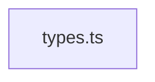

Repository Summary:
Files analyzed: 1
Directories scanned: 18
Total size: 110 bytes
Estimated tokens: 27
Processing time: 0.08 seconds


## Table of Contents

- [Project Summary](#project-summary)
- [Directory Structure](#directory-structure)
- [Files Content](#files-content)
  - Files:
    - [types.ts](#types_ts)
- [Dependency Diagram](#dependency-diagram)

## Project Summary <a id="project-summary"></a>

# Project Digest: test_project
Generated on: Sun Mar 23 2025 09:06:51 GMT+0100 (Central European Standard Time)
Source: /Users/giuseppe/Documents/Coding/SourceCodeFlatener_Extension/tests/test_project
Project Directory: /Users/giuseppe/Documents/Coding/SourceCodeFlatener_Extension/tests/test_project

# Directory Structure
[DIR] .

# Files Content

## src/types.ts <a id="types_ts"></a>

```typescript
interface TestInterface { property: string; }
class TestClass implements TestInterface { property = "value"; }
```

## Dependency Diagram

Below is a visualization of file dependencies in the codebase:



